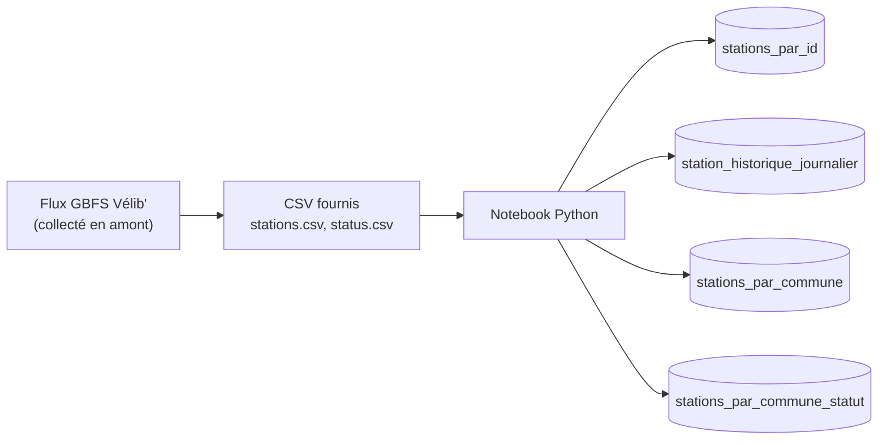

# Apache Cassandra

> **Objectif.** Concevoir des tables Cassandra à partir des requêtes d'une application de suivi des stations Vélib'.
> 
> **Prérequis** : 
> - avoir fork le projet `but3-formation-nosql-tp`
> - Jupyter Notebook et Python 3 installés
{:.block-example}

À la fin de ce TP, vous saurez :

- choisir une clé de partition et des clés de clustering à partir d'une requête ;
- écrire des requêtes CQL qui exploitent la clé primaire ;
- expliquer pourquoi Cassandra refuse certaines requêtes (filtrage, tri, jointure, agrégation) ;
- expliquer pourquoi un `UPDATE` sur une clé de clustering est refusé ;
- dénormaliser : stocker une même information dans plusieurs tables, chacune adaptée à une requête.

> :warning: Nous allons créer une base de données Apache Cassandra. Veuillez **utiliser les noms exacts** indiqués ci-dessous (nom de la base de données, nom du keyspace, etc.).
> Si vous les modifiez, il sera plus difficile de vous aider en cas de problème.
{:.block-warning}

## Données et application

L'application Vélib' doit répondre à quatre questions, chacune en quelques millisecondes, même avec des millions de mesures :

1. Quelles sont les informations d'une station ?
2. Comment a évolué sa disponibilité aujourd'hui ?
3. Quelles stations d'une commune ont le plus de vélos ?
4. Lesquelles de ces stations sont ouvertes à la location ?

En SQL, on créerait une table `stations`, une table `mesures`, puis on ferait des jointures et des `ORDER BY`.
**Avec Apache Cassandra, on fait l'inverse : on part des questions, puis on construit une table par question.**
Dans ce TP, vous allez d'abord essayer l'approche habituelle, constater où elle échoue, puis modéliser à la manière d'Apache Cassandra.

Pour ce TP, nous utiliserons les données du flux public **GBFS** ([General Bikeshare Feed Specification](https://github.com/MobilityData/gbfs)) de Vélib' sur les informations des stations et leur état courant (nom de la station, nombre de vélo disponibles, etc).
Le GBFS est une norme d'[*open data*](https://doc.transport.data.gouv.fr/type-donnees/velos-en-libre-service/normes-et-standards-gbfs) qui facilite la découverte et l'utilisation des modes de mobilité partagée.

Pour que tout le monde travaille sur le même flux de données, les informations ont été collectées en amont et figées dans deux fichiers CSV (`stations.csv` et `status.csv) qui vous sont mis à disposition.

| Fichier           | Contenu                                                                        | Volume approximatif |
|-------------------|--------------------------------------------------------------------------------|---------------------|
| `stations.csv`    | identifiant, code, nom, commune, coordonnées, capacité, moyens de location     | ~ 1 500 lignes      |
| `status.csv`      | une mesure pour 1000 stations, sur 3 jours                                     | ~ 42 000 lignes     |

Voici un extrait du flux :

```json
{
  "station_id": 427,
  "station_code": "04227",
  "name": "Château de Vincennes",
  "lat": 48.8442,
  "lon": 2.4407,
  "capacity": 46,
  "rental_methods": ["CREDITCARD", "KEY"]
}
```




Voici un tableau qui résume les besoins de l'application et les tables que vous allez créer pour y répondre.
Quelles sont les colonnes de la clé primaire pour chaque table ? Quelle requête sert chaque table ?

| Besoin de l'application | Table | Section | 
| --- | --- | --- |
| Fiche d'une station | `stations_par_id` | 3 |
| Historique d'une station un jour donné | `station_historique_journalier` | 4 |
| Classement des stations d'une commune | `stations_par_commune` | 5 | 
| Stations ouvertes ou fermées d'une commune | `stations_par_commune_statut` | 6 |


<!--- TODO : vérifier que les stations de référence existent dans les CSV, sinon adapter ce tableau et les énoncés. 
Les stations suivantes serviront de **stations de référence** dans les exercices :

| Identifiant de la station | Nom | Commune |
|  | --- | --- |
| 427 | Château de Vincennes | Vincennes |
| 501 | Mairie de Vincennes | Vincennes |
| 502 | Gare de Vincennes | Vincennes |
| 610 | Hôtel de Ville | Saint-Mandé |
| 611 | Bois de Vincennes | Saint-Mandé |
| 720 | Porte de Montreuil | Montreuil |
--->


# 1. Préparation de l'environnement

## 1.1 Récupération du notebook de template

Nous allons synchroniser votre fork du projet `but3-formation-nosql-tp` pour récupérer le notebook de template.

Pour cela, ouvrer GitHub à la page de votre fork, puis cliquez sur le bouton `Sync fork` et ensuite sur le bouton vert.
Cela met à jour votre fork avec les dernières modifications du dépôt original.



Le dossier `/TP2` contient désormais le notebook `TP2.ipynb`.

Il faut désormais mettre à jour le repo sur votre machine locale. Pour cela, ouvrez un terminal Git Bash et exécutez les commandes suivantes :

```bash
cd <votre-dossier-de-travail>
cd but3-formation-nosql-tp
git pull origin main
```
où `<votre-dossier-de-travail>` est le chemin vers dossier où vous avez cloné votre fork, par exemple `C:/Users/<votre-nom>/Documents/BU3/NoSQL/but3-formation-nosql-tp`.

Si vous utilisez une autre machine que lors du premier TP, vous devez cloner votre fork sur cette machine. Pour cela, ouvrez un terminal Git Bash et exécutez les commandes suivantes :

```bash
cd <votre-dossier-de-travail>
git clone <votre-fork-url>
cd but3-formation-nosql-tp
```

## 1.2 Création de la base de données

Nous allons créer un [compte DataStax Astra](https://astra.datastax.com/signup) afin de pouvoir héberger une base de données Apache Cassandra.

Une fois, la configuration terminée, vous pouvez créer une base de données Cassandra.
Choisissez une base de données **Serverless (non-vector)**. Ensuite, remplissez le nom de la base par `but-sd` et le keyspace par `velib`.
Sélectionnez le **cloud provider** AWS et la **région** par défaut (`us-east-2`), puis validez la création de la base.



Pendant la création de la base de données, vous pouvez générer un **token d'application** (avec le rôle `Database Administrator`) pour vous connecter depuis Python.
Copiez-le immédiatement sur un éditeur de texte : il n'est affiché qu'une fois. :warning: 



Une fois le token généré, il faut télécharger le **Secure Connect Bundle** (un fichier `.zip`).
Placez-le dans le dossier `TP2/` du repo `but3-formation-nosql-tp`.



> :warning: Ne placez jamais le token ou le bundle dans un dépôt Git.
> Vérifiez qu'ils figurent dans le `.gitignore` avant votre premier `git add`.
{:.block-warning}

:bulb: La création de la base de données prend quelques minutes.

## 1.3 Récupération des données

Les données sont fournies dans le repo `data/csv/velib` du projet.
Vous pouvez les télécharger via l'UI de [GitHub](https://github.com/aldevgen/data/tree/main/csv/velib).

<!--
Exécutez la cellule de connexion du notebook. Elle doit afficher la version de Cassandra.
--->

# 2. Le modèle Cassandra

## 2.1 Cassandra Query Language

CQL (Cassandra Query Language) est le langage de requête utilisé par Apache Cassandra. Bien qu'il ressemble à SQL, il est conçu pour les opérations de base de données distribuées sans prise en charge de certaines fonctionnalités comme les jointures.

Voici quelques exemples de commandes CQL pour interagir avec la base de données `library` qui contient les données des utilisateurs et des emprunts de livres d'une bibliothèque.

- **Création d'un keyspace** :
    Sur DataStax Astra, le keyspace est créé depuis l'interface. Si vous utilisez un cluster local, vous pouvez créer un keyspace avec la commande suivante :
    ```cql
    CREATE KEYSPACE library
    WITH replication = {'class': 'SimpleStrategy', 'replication_factor': 3};
    ```
  
- **Changement de keyspace** : 
    ```cql
    USE library ;
    ```
    L'instruction `USE` replace le keyspace courant par celui spécifié dans la requête.
    Ainsi, toutes les requêtes suivantes seront exécutées dans le keyspace `library`.
    Il n'est pas nécessaire de spécifier le keyspace dans les requêtes suivantes.
    On peut écrire directement `CREATE TABLE users (...)` sans spécifier le keyspace.

- **Liste des keyspaces** :
    ```cql
    DESCRIBE KEYSPACES;
    ```
    Cette commande permet de lister tous les keyspaces disponibles dans le cluster.

- **Description d'un keyspace** :
    ```cql
    DESCRIBE KEYSPACE library;
    ```
    Cette commande permet de voir les détails du keyspace `library`.

- **Suppression d'un keyspace** :
    ```cql
    DROP KEYSPACE IF EXISTS library;
    ```

- **Création d’une table** :
    - __Clé primaire simple__
    ```cql
    CREATE TABLE library.users (
        id UUID PRIMARY KEY,
        name TEXT,
        age INT
    );
    ```
    Pour plus d'informations sur les types de données supportés par Cassandra, vous pouvez consulter [la documentation](https://cassandra.apache.org/doc/latest/cql/types.html).

    - __Clé primaire composite__
    ```cql
    CREATE TABLE library.load (
        loan_id UUID,
        user_id UUID,
        timestamp TIMESTAMP,
        PRIMARY KEY (loan_id, user_id)
    );
    ```
    Ici nous avons une table qui possède deux colonnes comme clé primaire. Cela signifie que la combinaison de `loan_id` et `user_id` doit être unique.

    - __Clé de clustering__
    ```cql
    CREATE TABLE library.loan (
        loan_id UUID,
        user_id UUID,
        timestamp TIMESTAMP,
        PRIMARY KEY ((loan_id, user_id), timestamp)
    ) WITH CLUSTERING ORDER BY (timestamp DESC);
    ```
    Ici la clé primaire est composée de `driver_id` et `customer_id`, et la clé de clustering est `timestamp`.
    On ajoute `WITH CLUSTERING ORDER BY (timestamp DESC)` pour trier les données par ordre décroissant de `timestamp`.

- **Liste des tables** :
    ```cql
    DESCRIBE TABLES;
    ```
    Cette commande permet de lister toutes les tables du keyspace courant.

- **Description d'une table** :
    ```cql
    DESCRIBE TABLE library.users;
    ```
    Cette commande permet de voir les détails de la table `customers`.

- **Insertion de données** :
    ```cql
    INSERT INTO library.users (id, name, age)
    VALUES (6a6148d1-4a56-4d6a-a610-cdf7b7e3b959, 'Alice', 30);

    INSERT INTO library.users (id, name, age)
    VALUES (uuid(), 'Bob', 23);
    ```

- **Sélection de données** :
    ```cql
    SELECT * FROM library.users WHERE age > 25;
    ```

- **Mise à jour de données** :
    ```cql
    UPDATE library.users SET age = 26 WHERE id = 6a6148d1-4a56-4d6a-a610-cdf7b7e3b959;
    ```

- **Suppression de données** :
    ```cql
    DELETE FROM library.users WHERE id = 6a6148d1-4a56-4d6a-a610-cdf7b7e3b959;
    ```

- **Suppression d'une table** :
    ```cql
    DROP TABLE IF EXISTS library.users;
    ```

- **Création d'un index** :
    ```cql
    CREATE INDEX IF NOT EXISTS name_index ON library.users (name);
    ```

- **Suppression d'un index** :
    ```cql
    DROP INDEX IF EXISTS name_index;
    ```

Comme vu dans le cours, chaque table doit correspondre à une requête précise. Ainsi, il est important de bien choisir la clé de partition et la clé de clustering pour optimiser les performances de la base de données. Aussi, il peut être nécessaire de dupliquer les données pour répondre à différents types de requêtes.

> :warning: Toutes les colonnes qui sont dans la PRIMARY KEY doivent être utilisées dans la clause WHERE de la requête SELECT.
> Par exemple, si la clé primaire est composée de `id` et `name`, la requête SELECT doit contenir ces deux colonnes dans la clause WHERE.
{:.block-warning}

Pour aller plus loin, voici la documentation officielle de Cassandra :
- [Manipulation de données](https://cassandra.apache.org/doc/stable/cassandra/cql/ddl.html) : CREATE, ALTER, DROP (table, keyspace)
- [Requêtes](https://cassandra.apache.org/doc/stable/cassandra/cql/dml.html) : SELECT, INSERT, UPDATE, DELETE

## 2.2 Clés primaires et partitionnement

Une table Cassandra est conçue pour les requêtes que l'application exécutera.

Sa **clé primaire** a deux rôles :

- la **clé de partition** détermine sur quel nœud sont stockées les lignes. Toutes les lignes qui ont la même clé de partition forment une *partition* ;
- les **clés de clustering** ordonnent les lignes à l'intérieur d'une partition.

Une lecture efficace fournit la clé de partition complète : Cassandra sait alors où aller. Sans elle, il faudrait interroger tous les nœuds.
Comme nous l'avons vu dans le cours, une interrogation de tous les nœuds est coûteuse.

Testez ce principe avec une petite table d'exemple dans la console CQL :

```sql
CREATE TABLE station_demo (
    station_id int,
    ts timestamp,
    name       text,
    capacity   int,
    PRIMARY KEY (station_id, ts)
) WITH CLUSTERING ORDER BY (ts DESC);

INSERT INTO station_demo (station_id, ts, name, capacity)
VALUES (427, '2026-10-04 09:00:00+0000', 'Château de Vincennes', 46);
INSERT INTO station_demo (station_id, ts, name, capacity)
VALUES (427, '2026-10-04 09:05:00+0000', 'Château de Vincennes', 46);
INSERT INTO station_demo (station_id, ts, name, capacity)
VALUES (501, '2026-10-04 09:00:00+0000', 'Mairie de Vincennes', 30);

SELECT * FROM station_demo WHERE station_id = 427;

SELECT * FROM station_demo
WHERE station_id = 427
  AND ts >= '2026-10-04 09:00:00+0000'
  AND ts < '2026-10-04 09:05:00+0000';
```

Dans `PRIMARY KEY (station_id, ts)`, `station_id` est la clé de partition et `ts` la clé de clustering. Le premier `SELECT` rend les deux observations de la station 427, de la plus récente à la plus ancienne ; le second borne la recherche sur la clé de clustering.

Pour une clé de partition composée de plusieurs colonnes, on ajoute des parenthèses : `PRIMARY KEY ((commune, is_renting), station_id)`.

> ### Aide-mémoire CQL
> 
> - Les mots-clés ne sont pas sensibles à la casse ; une instruction se termine par `;`.
> - Les chaînes de caractères, les dates et les timestamps s'écrivent entre apostrophes simples ; `--` introduit un commentaire.
> - Types utilisés : `int`, `bigint`, `double`, `text`, `boolean`, `timestamp`, `date`, `set<text>`.
> - `INSERT` est un **upsert** : si la clé primaire existe, les colonnes fournies sont mises à jour, sinon la ligne est créée.
> - `UPDATE` et `DELETE` exigent la clé primaire complète dans le `WHERE`.
> - `DELETE` écrit une marque de suppression (**tombstone**) : les données ne sont pas effacées immédiatement du disque.
> - `LIMIT` restreint le nombre de lignes retournées ; il ne rend pas efficace une requête qui parcourt toutes les partitions.
{:.block-tip}


# 3. Les informations des stations

## 3.1 Créer la table

Créez une table `stations_par_id` pour retrouver les informations d'une station à partir de son identifiant.

| Colonne | Type CQL |
| --- | --- |
| `station_id` | `int` |
| `station_code` | `text` |
| `name` | `text` |
| `commune` | `text` |
| `lat` | `double` |
| `lon` | `double` |
| `capacity` | `int` |
| `rental_methods` | `set<text>` |

Choisissez la clé primaire : elle doit permettre de retrouver une station précise à partir de son identifiant.
Affichez ensuite la définition avec `DESCRIBE TABLE` et justifiez votre choix en une phrase.

## 3.2 Charger les données

Chargez les données de `stations_par_id` puis vérifiez le nombre de lignes :

```sql
SELECT COUNT(*) FROM stations_par_id;
```

<!--- TODO : indiquer le nombre attendu de lignes --->

## 3.3 Écrire les requêtes de lecture

Pour chaque besoin, écrivez et exécutez une requête CQL en ne conservant que les colonnes demandées. Pour chacune, notez quelles colonnes de la clé primaire apparaissent dans le `WHERE`.

1. Afficher toutes les informations de la station `427`.
2. Afficher le nom, la commune et la capacité de la station `610`.
3. Afficher uniquement les identifiants et les noms des stations `501`, `502` et `720`, **en une seule requête**.

> :bulb: Une requête qui restreint la clé de partition par `=` ou par `IN` est servie sans parcourir la table. Dans ce TP, les requêtes efficaces commencent par la clé de partition.
{:.block-tip}

## 3.4 Le moment de rupture

Vous connaissez l'approche habituelle : retrouver des lignes sur n'importe quelle colonne. Essayez-la. Pour chaque besoin, notez la requête tentée et le message de Cassandra :

1. Retrouver les stations de `Nanterre`.
2. Retrouver les stations dont la capacité est strictement supérieure à `30`.
3. Trier toutes les stations par capacité.

N'utilisez **pas** `ALLOW FILTERING` pour contourner les refus. Pour chaque besoin, expliquez pourquoi la clé primaire actuelle ne permet pas d'y répondre efficacement. Que se passerait-il avec 100 millions de stations ?

Répondez avec vos propres mots :

1. À quoi sert la clé de partition ?
2. Pourquoi une requête qui ne précise pas de clé de partition peut-elle être coûteuse ?
3. Que faudrait-il changer pour répondre à la question « stations d'une commune » ? (Vous le ferez en section 5.)

## 3.5 Modifier les données

Écrivez une requête pour chaque modification, puis relisez la ligne pour vérifier :

1. Passer la capacité de la station `501` à `32`.
2. Ajouter le moyen de location `APPLEPAY` à la station `427`, sans remplacer les moyens déjà présents.
3. Retirer le moyen de location `KEY` de la station `427`.
4. Modifier le nom de la station `720`.
5. Supprimer la colonne `lon` de la station `611`, sans supprimer le reste de la station. Qu'affiche Cassandra pour cette colonne ?

> Pour une collection `set`, `+` ajoute des valeurs et `-` en retire : `SET colonne = colonne + {'valeur'}`.
{:.block-tip}

# 4. Historiser les mesures

## 4.1 Définir les besoins de lecture

L'état d'une station est publié périodiquement. L'application doit pouvoir :

- afficher les dernières mesures d'une station pour un jour donné ;
- retrouver les mesures d'une station entre deux heures ;
- lire les mesures dans l'ordre chronologique, même si la table stocke les plus récentes en premier.

Concevez une table `station_historique_journalier` :

| Colonne | Type CQL |
| --- | --- |
| `station_id` | `int` |
| `day` | `date` |
| `ts` | `timestamp` |
| `mechanical` | `int` |
| `electrical` | `int` |
| `num_docks_available` | `int` |
| `is_renting` | `boolean` |

La clé primaire doit créer **une partition par station et par jour**, puis trier les mesures par horodatage décroissant. Ajoutez une durée de vie par défaut de 30 jours (2592000 secondes).

> Pour la durée de vie, utilisez l'option de table `default_time_to_live`, exprimée en **secondes**. Elle est comptée à partir de l'insertion de la ligne, pas de son horodatage : les lignes chargées pour ce TP disparaîtront 30 jours après leur chargement.
{:.block-tip}

Affichez la définition de la table, puis expliquez la clé de partition et la clé de clustering.

## 4.2 Charger les mesures

Chargez les données de la table `station_historique_journalier`, puis vérifiez :

```sql
SELECT COUNT(*) FROM station_historique_journalier
WHERE station_id = 427 AND day = '2026-10-04';
```

<!--- TODO : indiquer le nombre attendu (288 si une mesure toutes les 5 minutes sur une journée complète) --->

## 4.3 Écrire des requêtes temporelles

Pour la station `427`, écrivez une requête pour chaque besoin :

1. Afficher les quatre dernières mesures du `4 octobre 2026`.
2. Afficher uniquement l'horodatage, le nombre de vélos mécaniques et le nombre de bornes libres pour cette journée, limités à 10 lignes.
3. Afficher les mesures comprises entre `09:00` et `09:30`, inclusivement.
4. Afficher les mesures de cette même plage dans l'ordre chronologique, de la plus ancienne à la plus récente.
5. Afficher les mesures de la station `501` pour cette même journée. Vérifier que les données d'une station ne se mélangent pas à celles d'une autre.
6. Insérer une mesure à `09:02` pour la station `427` avec la valeur `is_renting = false`. Que se passe-t-il, sachant qu'une mesure existe déjà à cet horodatage ? Relisez la ligne pour vérifier.

Testez ensuite une requête qui ne donne que l'horodatage, sans station ni jour. Relevez l'erreur et expliquez pourquoi la clé de partition doit être fournie.

## 4.4 Comprendre le découpage par jour

La clé de partition contient le jour pour éviter qu'une partition de station grandisse sans limite. Une recherche qui couvre plusieurs jours doit donc interroger plusieurs partitions.

1. Écrivez les requêtes qui retournent les mesures du `3` et du `4 octobre` pour la station `427`. Pouvez-vous le faire en une seule requête ?
2. Expliquez comment une application déterminerait les jours concernés par une période de 24 heures et combinerait les résultats.
3. Calculez le nombre maximal de lignes par partition si une mesure est enregistrée chaque minute. Comparez avec le `COUNT(*)` observé en 4.2. Quel est l'intérêt d'une telle borne ?
4. Expliquez le compromis entre un bucket par jour et un bucket par heure.

# 5. Classer les stations d'une commune

## 5.1 Besoin de l'application

L'application souhaite afficher les stations d'une commune, de la plus grande disponibilité de vélos à la plus faible. La table `stations_par_id` ne le permet pas : ni la commune ni le nombre de vélos n'en sont des clés.

Concevez une table `stations_par_commune` selon ces règles :

- la requête connaît le nom de la commune ;
- les lignes d'une commune sont regroupées dans une même partition ;
- le nombre de vélos disponibles permet le classement ;
- `station_id` distingue deux stations qui ont le même nombre de vélos ;
- les résultats sont stockés du plus grand nombre de vélos au plus petit.

Avant de créer la table, **dessinez sa clé primaire** et identifiez la clé de partition et les colonnes de clustering. Puis créez-la avec les colonnes `commune`, `num_bikes_available`, `station_id` et `name`.

## 5.2 Charger les données

Le nombre de vélos disponibles d'une station n'est pas dans `stations.csv` : il se déduit de **sa dernière mesure** dans `status.csv` (somme des vélos mécaniques et électriques).
Depuis le notebook, chargez les données de `stations_par_commune` : calculez ces valeurs avec pandas, puis insérez les lignes avec la fonction `load` fournie.

> C'est le moment où vous écrivez la même station dans plusieurs tables : c'est la dénormalisation.
{:.block-tip}

## 5.3 Écrire les requêtes

1. Afficher les stations de `Nanterre` dans l'ordre défini par la table.
2. Afficher les deux premières stations de `Nanterre`.
3. Afficher les stations de `Saint-Mandé`.
4. Afficher les stations de `Nanterre` qui n'ont aucun vélo. Si aucune ne convient, ajoutez d'abord une station appropriée.
5. Retrouver la station `502` dans la partition `Nanterre`.

## 5.4 Mettre à jour une clé de clustering

La station `427` passe à 3 vélos disponibles. Modifiez son état dans `stations_par_commune`.

1. Essayez de modifier directement `num_bikes_available` avec un `UPDATE`.
2. Relevez et expliquez le résultat.
3. Écrivez les opérations nécessaires pour supprimer l'ancienne ligne puis insérer la nouvelle.
4. Relisez la partition de `Nanterre` et vérifiez que l'ancienne disponibilité de la station `427` a disparu.

Expliquez en quoi ce cas illustre le coût de la dénormalisation, et pourquoi l'application doit tenir à jour toutes les tables de requêtes.

# 6. Concevoir une table à partir d'un besoin

La ville veut obtenir rapidement les stations d'une commune qui sont ouvertes à la location, sans parcourir toutes les stations.

1. Écrivez le besoin sous la forme d'une phrase : quelles informations l'application connaît-elle avant la lecture ? Quelles informations veut-elle afficher ?
2. Proposez une clé primaire dont la clé de partition combine la commune et l'état de location, et dont la clé de clustering identifie une station dans ce groupe.
3. Créez la table `stations_par_commune_statut` avec les colonnes nécessaires.
4. Chargez-y, depuis le notebook ou avec des `INSERT`, au moins quatre stations réparties sur deux communes et deux états de location.
5. Écrivez les requêtes qui affichent les stations ouvertes d'une commune, puis les stations fermées de cette même commune.
6. Demandez toutes les stations ouvertes, sans préciser de commune. Expliquez le résultat et indiquez si cette table répond à ce besoin.

Si le besoin ne correspond pas à la clé de partition, ne forcez pas le filtrage : proposez une autre table, conçue pour la nouvelle requête.

# 7. Requêtes impossibles ou coûteuses

À partir des tables du TP, testez les demandes suivantes. Pour chacune, notez la requête tentée et le message de Cassandra, puis expliquez la cause et la solution de modélisation que vous proposeriez.

1. Calculer la moyenne de vélos disponibles pour toutes les stations.
2. Afficher toutes les mesures de toutes les stations d'un jour donné dans `station_historique_journalier`.
3. Joindre la table des stations et la table de mesures.
4. Chercher toutes les stations qui acceptent un moyen de location donné, sans fournir d'identifiant ni de commune.

N'ajoutez pas `ALLOW FILTERING` avant d'avoir expliqué son coût potentiel. Avec ces volumes, la requête s'exécutera rapidement : raisonnez sur ce qui se passerait avec 100 millions de lignes. Pour un besoin fréquent, concevez une table dont la clé permet directement la lecture attendue.

# 8. Bilan

1. Complétez le tableau fil rouge de l'introduction : pour chaque table, indiquez la clé de partition, les clés de clustering et la requête qu'elle sert.
2. Quelle est la différence entre une clé de partition et une clé de clustering ?
3. Pourquoi a-t-on besoin de plusieurs tables pour les informations de station, l'historique et le classement par commune ?
4. Pourquoi Cassandra n'est-elle pas adaptée aux tris et agrégations improvisés sur l'ensemble des données ?
5. Quel est le rôle de `ALLOW FILTERING` ? Pourquoi n'est-ce pas une solution générale ?
6. Quel problème le découpage journalier de l'historique résout-il, et quel nouveau travail impose-t-il à l'application ?
7. Donnez un exemple où la dénormalisation a simplifié une lecture et un exemple où elle a compliqué une mise à jour.