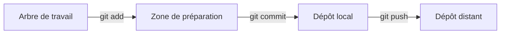

# Les commandes Git

## Le cycle de base

Git suit les modifications en trois étapes :

1. **Modifier** les fichiers dans l'arbre de travail.
2. **Préparer** les modifications avec `git add`.
3. **Enregistrer** une version avec `git commit`.



### La métaphore de la photographie

Le cycle Git ressemble à la prise d'une photo :

1. **Modifier le code** : le fichier est la scène que l'on prépare
2. **`git add`** : le cadre est choisi &rarr; le contenu sélectionné entre dans la zone de préparation
3. **`git commit`** : le bouton est pressé &rarr; Git prend une photo et l'ajoute à l'album de l'historique
4. **`git push`** : la photo est importée dans l'album partagé &rarr; elle est visible par tous les collaborateurices.

> :bulb: **À retenir**
> - `git add` choisit ce qui apparaîtra dans la photo
> - `git commit` enregistre cette photo de manière permanente dans l'historique
{:.block-tip}

### Vérifier l'état du dépôt

La commande `git status` indique les fichiers nouveaux, modifiés ou préparés :

```bash
git status
```

Elle permet notamment de savoir si :

- un fichier n'est pas encore suivi ;
- des modifications ne sont pas encore préparées ;
- des modifications sont prêtes pour le prochain commit ;
- l'arbre de travail est propre.

### Préparer des modifications

Ajoutez un fichier ou une modification à la zone de préparation :

```bash
git add nom-du-fichier
```

Pour ajouter plusieurs fichiers du dossier courant :

```bash
git add .
```

Pour retirer un fichier de la zone de préparation sans supprimer ses modifications :

```bash
git restore --staged nom-du-fichier
```

### Inspecter les différences

Avant de préparer une modification, utilisez `git diff` :

```bash
git diff
```

Cette commande affiche les changements présents dans l'arbre de travail, mais pas encore dans la zone de préparation.

Après `git add`, consultez les changements qui seront enregistrés :

```bash
git diff --staged
```

Une ligne commençant par `+` a été ajoutée et une ligne commençant par `-` a été supprimée.

### Créer un commit

Enregistrez les modifications préparées avec un message explicite :

```bash
git commit -m "Décrit la modification réalisée"
```

Le commit crée une version permanente dans le dépôt local, à l'intérieur du dossier `.git`.

### Écrire un bon message

Un message de commit doit être court, précis et descriptif :

```text
Ajoute la validation du formulaire
Corrige le calcul du total
Documente l'installation du projet
```

Évitez les messages vagues comme `modifications`, `update` ou `travail`. Pour écrire un message plus détaillé, lancez `git commit` sans l'option `-m` : Git ouvrira l'éditeur configuré.

### Consulter l'historique

Affichez l'ensemble des commits :

```bash
git log
```

Utilisez une version compacte et graphique :

```bash
git log --oneline --decorate --graph
```

L'historique contient notamment l'identifiant du commit, son auteur, sa date et son message.

# Mise en pratique : une mission spatiale

Une équipe scientifique prépare une mission robotique vers Mars. Pour suivre les différentes étapes de la mission, elle décide d'utiliser Git. Git va permettre de consigner les événements dans un dépôt nommé `mission-spatiale`. Chaque étape importante sera ajoutée au journal de bord, puis enregistrée dans l'historique.

Les commandes sont exécutées depuis le dossier du dépôt :

```bash
cd mission-spatiale
```

## Créer un fichier

Créez un fichier `journal-de-bord.md` avec votre IDE et saisissez :

```markdown
# Journal de bord — Mission Mars

La mission robotique est prête pour son départ.
```

Enregistrez le fichier avec une nouvelle ligne à la fin.

Vous pouvez également créer et modifier le fichier depuis le terminal :

```bash
nano journal-de-bord.md
```

## Vérifier l'état du dépôt

Demandez à Git ce qui a changé :

```bash
git status
```

Git indique alors que `journal-de-bord.md` est un fichier **non suivi** :

```text
On branch main
Your branch is up to date with 'origin/main'.

Untracked files:
  (use "git add <file>..." to include in what will be committed)
        journal-de-bord.md

nothing added to commit but untracked files present (use "git add" to track)
```

Un fichier non suivi existe dans le dossier de travail, mais Git ne l'a pas encore ajouté à l'historique. Le fichier est visible sur l'ordinateur, mais il ne fait pas encore partie du prochain commit.

## Ajouter le fichier à la zone de préparation

Pour demander à Git de suivre le fichier :

```bash
git add journal-de-bord.md
```

Vérifiez ensuite l'état du dépôt :

```bash
git status
```

Le fichier apparaît maintenant dans les changements prêts à être commités :

```text
Changes to be committed:
  (use "git restore --staged <file>..." to unstage)
        new file:   journal-de-bord.md
```

Git connaît désormais `journal-de-bord.md`, mais les modifications ne sont pas encore enregistrées dans l'historique.

## Enregistrer un commit

Enregistrez le contenu préparé avec un message explicite :

```bash
git commit -m "Crée le journal de la mission Mars"
```

La sortie ressemble à ceci :

```text
[main 9b26458] Crée le journal de la mission Mars
 1 file changed, 1 insertion(+)
 create mode 100644 journal-de-bord.md
```

L'identifiant `9b26458` est un exemple d'identifiant court. Le vôtre sera différent.

Lors d'un commit, Git prend tout ce qui a été placé dans la zone de préparation avec `git add` et en conserve une copie dans le répertoire spécial `.git`. Cette copie permanente s'appelle un **commit** ou une **révision**.

## Écrire un bon message de commit

L'option `-m` signifie **message** :

```bash
git commit -m "Crée le journal de la mission Mars"
```

Un bon message de commit est :

- court ;
- précis ;
- descriptif ;
- centré sur une modification cohérente.

Mais à quoi sert le message de commit ?
Ce dernier a plusieurs utilités.
D'une part, il permet aux autres membres du repo de voir les modifications qui ont été apportées.
D'autre part, en cas de besoin de revenir à une précédente version, il permet de savoir où se situer dans l'historique.

Évitez les messages trop vagues :

```text
modifications
update
travail
corrections diverses
```

Il est préférable de décrire ce qui a été fait, par exemple :

```text
Crée le journal de la mission Mars
Corrige le calcul du total
Ajoute la validation du formulaire
```

Il est recommandé de résumer la modification en moins de 50 caractères lorsque cela est possible.
Pour ajouter des explications, laissez une ligne vide après le résumé :

```bash
git commit
```

Git ouvre alors l'éditeur configuré avec `core.editor`. Le message peut contenir un résumé, une ligne vide, puis une description plus détaillée du contexte et de la solution.

## Vérifier l'état après le commit

```bash
git status
```

Le résultat indique que l'arbre de travail est propre :

```text
On branch main
Your branch is ahead of 'origin/main' by 1 commit.
  (use "git push" to publish your local commits)

nothing to commit, working tree clean
```

Le dépôt local possède un commit de plus que le dépôt distant. Le commit n'est pas encore publié sur GitHub.
La commande `git push` sera étudiée dans un prochain chapitre.

## Consulter l'historique

Pour afficher les commits du dépôt :

```bash
git log
```

Pour obtenir une vue plus concise :

```bash
git log --oneline --decorate --graph
```

Chaque commit contient notamment :

- un identifiant complet ;
- l'auteur ;
- la date de création ;
- le message du commit ;
- les références vers les branches concernées.

Les commits sont affichés dans l'ordre chronologique inverse : le plus récent apparaît en premier.

## Modifier le fichier

L'équipe ajoute un nouvel événement dans `journal-de-bord.md` :

```text
La mission robotique est prête pour son départ.
La sonde quitte la Terre et commence son voyage vers Mars.
```

Enregistrez le fichier, puis vérifiez son état :

```bash
git status
```

Git indique qu'un fichier déjà suivi a été modifié :

```text
Changes not staged for commit:
  (use "git add <file>..." to update what will be committed)
  (use "git restore <file>..." to discard changes in working directory)
        modified:   journal-de-bord.md

no changes added to commit
```

La dernière ligne est importante : le fichier a été modifié, mais ces changements n'ont pas encore été ajoutés à la zone de préparation.

## Inspecter les différences avec `git diff`

Avant d'enregistrer une modification, relisez-la :

```bash
git diff
```

Git peut afficher :

```diff
diff --git a/journal-de-bord.md b/journal-de-bord.md
index 0b592c6..d27fc77 100644
--- a/journal-de-bord.md
+++ b/journal-de-bord.md
@@ -1,4 +1,5 @@
 # Journal de bord — Mission Mars
 
 La mission robotique est prête pour son départ.
+La sonde quitte la Terre et commence son voyage vers Mars.
```

Cette sortie compare l'ancienne version et la nouvelle version du fichier :

- `---` désigne l'ancienne version ;
- `+++` désigne la nouvelle version ;
- `@@` indique la zone du fichier concernée ;
- une ligne commençant par `+` a été ajoutée ;
- une ligne commençant par `-` a été supprimée ;
- une ligne sans signe indique le contexte conservé.

Le contenu de `git diff` peut sembler technique : il est conçu pour permettre à des outils de reconstruire les différences entre deux versions.

Après vérification, préparez puis commitez le changement :

```bash
git add journal-de-bord.md
git commit -m "Documente le départ de la sonde"
```

Si `git commit` est lancé avant `git add`, Git ne prend pas la modification en compte. Cette étape intermédiaire permet de construire un commit avec des changements logiques, même lorsque plusieurs fichiers ont été modifiés.

> :warning: Vérifiez toujours `git diff` avant `git add`, puis `git diff --staged` après `git add`.
> Cela évite d'enregistrer par erreur un fichier ou une modification non prévue.
{:.block-warning}

## Ajouter une nouvelle modification

Ajoutez un nouvel événement à `journal-de-bord.md` :

```text
La mission robotique est prête pour son départ.
La sonde quitte la Terre et commence son voyage vers Mars.
La sonde atteint l'orbite de Mars et commence l'analyse du sol.
```

Consultez la différence :

```bash
git diff
```

Puis préparez et commitez :

```bash
git add journal-de-bord.md
git commit -m "Documente l'arrivée en orbite de Mars"
```

Le panneau **Source Control** de l'IDE affiche les mêmes informations que les commandes Git :

- le fichier apparaît dans les changements avant `git add` ;
- le bouton `+` ajoute le fichier à la zone de préparation ;
- un message peut être saisi pour créer le commit ;
- l'historique présente les commits successifs.

L'interface graphique et le terminal utilisent les mêmes opérations Git. Il est utile de savoir passer de l'un à l'autre pour comprendre ce qui est réellement enregistré.

# Challenge

1. Créez un fichier `mars.txt`.
2. Ajoutez une première mission et faites un commit.
3. Ajoutez une deuxième mission.
4. Consultez `git status` et `git diff`.
5. Ajoutez uniquement `mars.txt` à la zone de préparation.
6. Consultez `git diff --staged`.
7. Créez un commit avec un message descriptif.
8. Affichez l'historique avec `git log --oneline --graph`.

> :bulb: **À retenir**
> - `git status` affiche l'état du dépôt.
> - Un fichier peut se trouver dans l'arbre de travail, la zone de préparation ou le dépôt local.
> - `git add` place un fichier ou une modification dans la zone de préparation.
> - `git commit` enregistre le contenu préparé dans le dépôt local.
> - `git diff` affiche les changements non préparés.
> - `git diff --staged` affiche les changements préparés.
> - `git log` affiche l'historique des commits.
> - Un message de commit doit expliquer clairement ce qui a été fait.
{:.block-tip}
