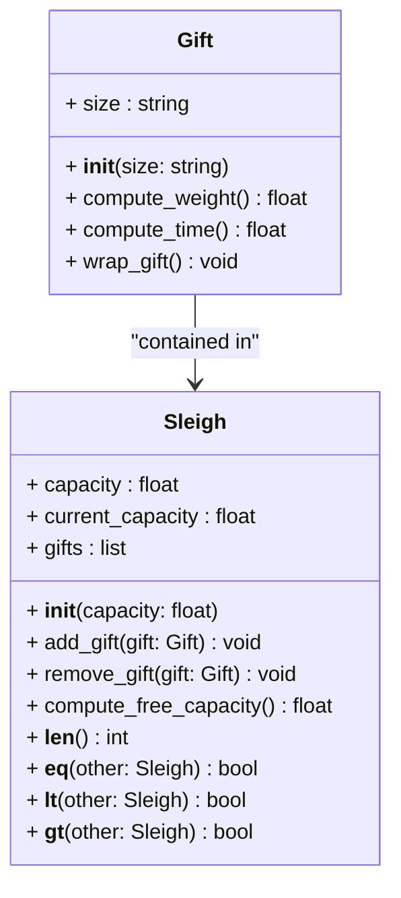
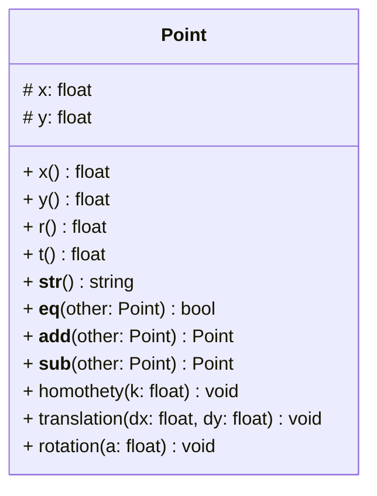

# Méthodes spéciales

Les `méthodes spéciales`, aussi appelées méthodes magiques ou méthodes du double underscore (dunder), sont des méthodes prédéfinies en Python qui permettent de surcharger le comportement des opérateurs et des fonctions intégrées. Ces méthodes sont appelées automatiquement par l'interpréteur Python en fonction de l'opération effectuée.

## Exercice 1 : traîneau de la Mère Noël

La Mère Noël souhaite optimiser la distribution des cadeaux en traîneau. Pour cela, elle a besoin de calculer la capacité de son traîneau en fonction de la taille des cadeaux.

La Mère Noël veut également calculer le temps de chargement des cadeaux dans le traineau. Pour cela, cela elle vous demande de créer un décorateur `@timer` qui permet de mesurer le temps d'exécution d'une méthode.

Définissez une classe `Gift` qui permet de représenter un cadeau, caractérisé par sa taille. Les cadeaux sont classés en trois catégories : Small, Medium et Large qui ont les caractéristiques suivantes : 

| Taille | Poids | Temps d'emballage |
|--------|-------|-------------------|
| Small  | 1 kg  | 1 seconde         |
| Medium | 2 kg  | 3 secondes        |
| Large  | 5 kg  | 10 secondes       |

 

La classe `Gift` aura les méthodes suivantes :

- `__init__(size: str)` : constructeur d’un cadeau à partir de sa taille.
- `compute_weight()` : méthode décorée par `@timer` qui renvoie le poids du cadeau.
- `compute_time()` : méthode décorée par `@timer` qui renvoie le temps d'emballage du cadeau.
- `wrap_gift()` : méthode décorée par `@timer` qui attend le temps d'emballage du cadeau (i.e. `time.sleep()`)

Définissez une classe `Sleigh` qui permet de calculer la capacité du traîneau en fonction de la taille des cadeaux. La classe `Sleigh` comportera au moins les méthodes suivantes :

- `__init__(capacity: float)` : constructeur d’un traîneau à partir de sa capacité.
- `compute_free_capacity()` : renvoie la capacité restante du traîneau.
- `add_gift(gift: Gift)` : ajoute un cadeau au traîneau (seulement si la capacité du traîneau est suffisante).
- `remove_gift(gift: Gift)` : retire un cadeau du traîneau.
- `__len__()` : renvoie la capacité du traîneau.
- `__eq__(other: Sleigh)` : compare si les traîneaux ont la même capacité.
- `__lt__(other: Sleigh)` : compare si la capacité du traîneau est inférieure à celle d'un autre traîneau.
- `__gt__(other: Sleigh)` : compare si la capacité du traîneau est supérieure à celle d'un autre traîneau.

Créer une classe main qui permet de tester les classes `Gift` et `Sleigh`.

## Exercice 2 : points du plan

Définissez une classe `Point` pour représenter les points du plan rapporté à une origine fixée.
Les coordonnées d’un point sont ici deux nombres flottants `x`, `y`, qui sont deux attributs **privés**.

La classe `Point` comportera au moins les méthodes suivantes :

- `__init__(x, y)` : constructeur d’un point à partir de ses coordonnées cartésiennes.
- Les méthodes `x()` et `y()` retournent les coordonnées cartésiennes du point. Les méthodes `r()` et `t()` retournent les coordonnées polaires du point (voir ci-dessous). Ces 4 méthodes sont définies comme des propriétés.
- `__str__()` : renvoie les coordonnées du point sous format texte. Par exemple, si on crée un point d'abscisse 2 et d'ordonnée 3 (i.e. `Point(x=2, y=3)`), la fonction retournera $$(2.0, 3.0)$$.
- `__eq__(other)` : compare si les points sont identiques (i.e. ont les mêmes coordonnées).
- `__add__(other)` : additionne les coordonnées de deux points pour obtenir un nouveau point.
- `__sub__(other)` : soustrait les coordonnées de deux points pour obtenir un nouveau point.
- `homothety(k)` : applique au point une homothétie de centre $$(0, 0)$$ et de rapport $$k$$ (k est un flottant). Pour cela, on multiplie les coordonnées $$(x, y)$$ par $$k$$ pour obtenir $$(kx, ky)$$.
- `translation(dx, dy)` : applique au point une translation de vecteur $$(dx, dy)$$. Cela consiste à remplacer $$(x, y)$$ par $$(x + dx, y + dy)$$.
- `rotation(a)` : applique au point une rotation de centre $$(0, 0)$$ et d’angle $$a$$. Une manière – qui n’est pas la plus efficace – de faire cela consiste à calculer les coordonnées polaires $$(r, t)$$ correspondant à $$(x, y)$$ puis les coordonnées cartésiennes $$(x′, y′)$$ correspondant à $$(r, t + a)$$.

#### Rappel des formules

- Coordonnées cartésiennes à partir des coordonnées polaires : $$x = r cos(t)$$ et $$y = r sin(t)$$
- Coordonnées polaires à partir des coordonnées cartésiennes : $$r = \sqrt{x^2 + y^2}$$ et $$t = atan2(y, x)$$
