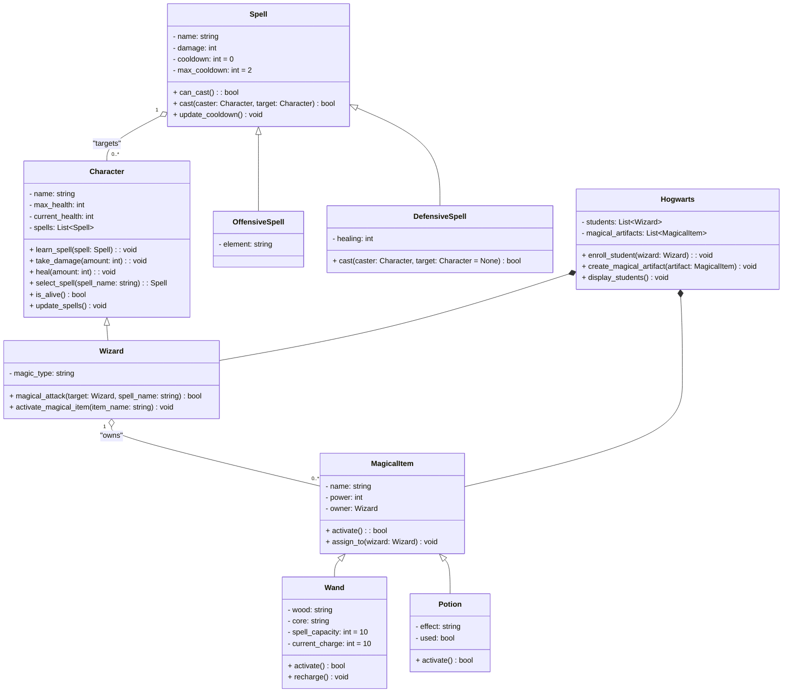
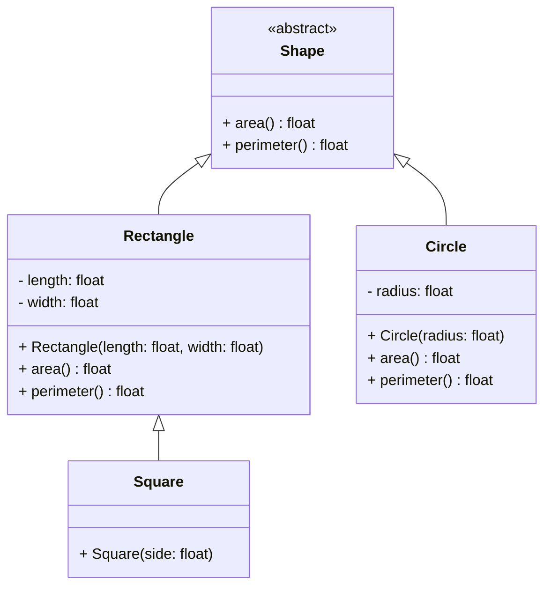
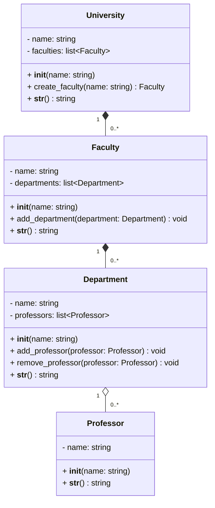
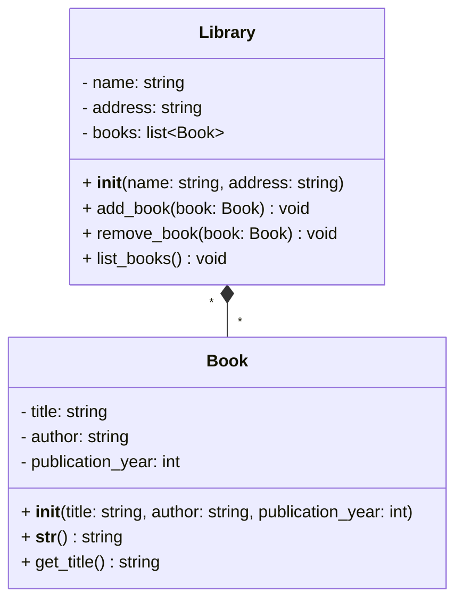
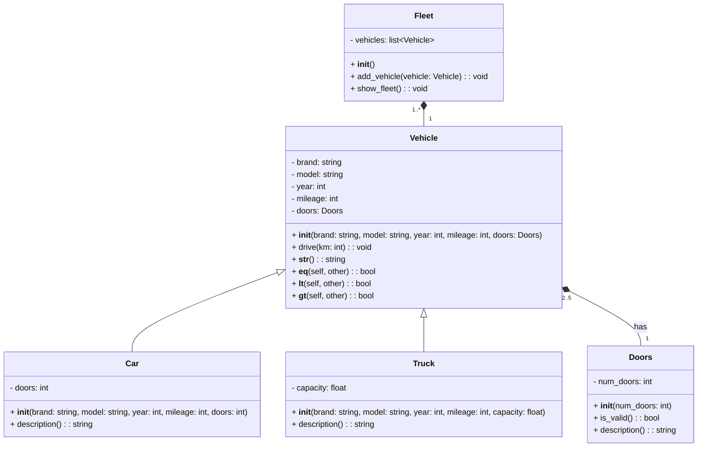
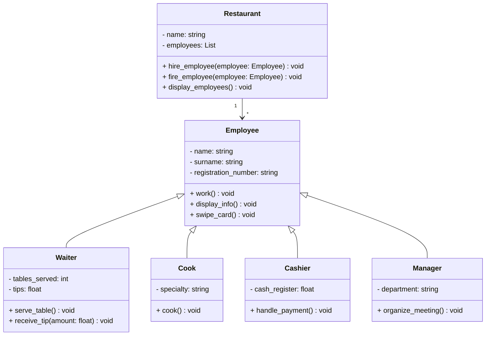

# Relations entre objets

## Exercice 1 : diagramme UML

À partir du code suivant, créez un diagramme UML pour représenter les classes `Engine`, `Wheel`, `Car`, `Truck` et `Garage`.

```python
class Engine:
    def __init__(self, power: int, cylinders: int):
        self.power = power
        self.cylinders = cylinders

class Wheel:
    def __init__(self, size: int):
        self.size = size

class Car:
    def __init__(self, brand: str, engine: Engine, wheels: list[Wheel]):
        self.brand = brand
        self.engine = engine
        self.wheels = wheels

class Truck(Car):
    def __init__(
		self, brand: str, engine: Engine,
		wheels: list[Wheel], load_capacity: int
	):
        super().__init__(brand, engine, wheels)
        self.load_capacity = load_capacity

class Garage:
    def __init__(self, name: str):
        self.name = name
        self.cars = []

    def add_car(self, car: Car):
        self.cars.append(car)
```

Vous pouvez faire le diagramme UML sur papier ou utiliser un outil en ligne comme [Draw.io](https://app.diagrams.net/).

## Exercice 2 : système de gestion magique à Poudlard

Poudlard, l'école des sorciers, souhaite mettre en place un système pour gérer les magiciens et objets magiques. À cette fin, vous êtes chargé de développer une application utilisant les principes de la Programmation Orientée Objet (POO).



**Question 1 : Classe `AbstractMagicalItem`**  

Créer une classe abstraite `AbstractMagicalItem` (fichier `abstract_magical_item.py`) avec :  
- **Attributs** :  
  - `name` : nom de l'objet magique  
  - `power` : puissance de l'objet  
- **Méthodes** : 
  - `assign_to(wizard: Wizard)` : pour attribuer l'objet à un sorcier (ajouter l'objet à la liste des objets magiques du sorcier).
  - Méthode abstraite `activate()` qui renvoie un booléen.

---

**Question 2 : Classes `Wand` et `Potion`**  

Créer les classes `Wand` et `Potion` héritant de `MagicalItem`.

- **Pour `Wand`** (fichier `wand.py`) :  
  - Attributs :
    - `wood` : type de bois de la baguette.
    - `core` : type de noyau de la baguette.
    - `spell_capacity` : capacité de sorts de la baguette (définie par défaut à 10).
    - `current_charge` : charge actuelle de la baguette.
  - **Méthodes** : 
    - `activate()` pour lancer un sort (diminue la charge actuelle de la baguette). 
    - `recharge(power : int)` pour recharger la baguette qui est définit par le minimum entre 10 et la charge actuelle + `power` (par défaut `power` vaut 5).

- **Pour `Potion`** (fichier `potion.py`) :  
  - Attributs :
    - `effect` : effet de la potion.
    - `used` : indique si la potion a été utilisée.
  - **Méthodes** :
    - `activate()` pour activer la potion (marque la potion comme utilisée).

---

**Question 3 : Classes de Sorts**  

Créer une classe `Spell` (fichier `spell.py`) et ses classes dérivées `OffensiveSpell` et `DefensiveSpell` :  

- **Pour `Spell`** :  
  - **Attributs** : 
    - `name` : nom du sort.
    - `damage` : dégâts infligés par le sort.
    - `cooldown` : temps de recharge du sort.
    - `max_cooldown` : temps de recharge maximal du sort, par défaut 2.
  - **Méthodes** :
    - `cast(caster: Character, target: Character)` : pour lancer le sort (diminue la santé de la cible) et retourne un booléen indiquant si le sort a été lancé avec succès.
    - `update_cooldown()` : pour mettre à jour le temps de recharge du sort, qui est le maximum entre 0 et le temps de recharge actuel - 1.

- **Pour `OffensiveSpell`** :  
  - **Attribut** :
    - `element` : élément du sort (e.g. feu, glace, foudre, saignement, désarmement).

- **Pour `DefensiveSpell`** :  
  - **Attribut** :
    - `healing` : quantité de soin apportée par le sort.
  - **Méthode** :
    - `cast(caster: Character, target: Character)` : pour lancer le sort (augmente la santé de la cible et modifie le `cooldown` à `max_cooldown`) et retourne un booléen indiquant si le sort a été lancé avec succès.

---

**Question 4 : Classe `Character`**  

Créer une classe abstraite `Character` (fichier `character.py`) avec :  

- **Attributs** :  
  - `name` : nom du personnage  
  - `max_health` : santé maximale  
  - `current_health` : santé actuelle
  - `spells` : liste des sorts appris par le personnage.

- **Méthodes** :  
  - `learn_spell(spell: Spell)` : pour apprendre un sort (ajoute le sort à la liste des sorts du personnage).
  - `take_damage(amount: int)` : pour recevoir des dégâts (diminue la santé du personnage) :warning: attention à ne pas descendre en dessous de 0.
  - `heal(amount: int)` : pour soigner le personnage (augmente la santé du personnage) :warning: attention à ne pas dépasser la santé maximale.
  - `select_spell(spell_name: string)` : retourne le sort correspondant au nom donné, s'il n'existe pas, retourne `None`.
  - `is_alive()` : pour vérifier si le personnage est toujours en vie (i.e. `current_health` > 0).
  - `update_spells()` : pour mettre à jour les temps de recharge des sorts (i.e. appel de la méthode `update_cooldown` pour chaque sort).

---

**Question 5 : Classe `Wizard`**  

Créer la classe `Wizard` (fichier `wizard.py`) héritant de `Character` avec :  

- **Attributs** :  
  - `magic_type` : type de magie pratiqué par le sorcier.
  - `magical_items` : liste des objets magiques possédés par le sorcier.

- **Méthodes** :  
  - `magical_attack(target: Wizard, spell_name: string)` : attaque un autre sorcier avec un sort.
  - `activate_magical_item(item_name)` : active un objet magique possédé par le sorcier.

---

**Question 6 : Classe `Hogwarts`**  

Créer la classe `Hogwarts` (fichier `hogwarts.py`) avec :  

- **Attributs** :  
  - `students` : liste des sorciers inscrits.
  - `magical_artifacts` : liste des objets magiques disponibles.

- **Méthodes** :  
  - `enroll_student(wizard: Wizard)` : inscrire un étudiant.
  - `create_magical_artifact(artifact: MagicalItem)` : ajouter un objet magique.
  - `display_students()` : afficher la liste des étudiants inscrits.

---

**Question 7 : Programme Principal**  

Dans `main.py`, réaliser les tâches suivantes :  

1. Créer des personnages magiques.
2. Créer des objets magiques.
3. Simuler un combat entre personnages.
4. Montrer les interactions entre personnages et objets magiques.

## Exercice 3 : formes géométriques

Cet exercice vise à créer un programme en Python pour gérer différentes formes géométriques (formes de base comme un rectangle, un carré, etc.), en utilisant des classes, de l'héritage et le polymorphisme.



1. **Créer une classe `Shape`** (fichier `shape.py`) :

   - Cette classe sera une classe abstraite pour les formes géométriques (forme de base).
   - Elle doit contenir une méthode abstraite `area()` qui sert à calculer l'aire de la forme.
   - Elle doit contenir une méthode abstraite `perimeter()` qui sert à calculer le périmètre de la forme.
     <br/><br/>

2. **Créer une classe `Rectangle`** (fichier `rectangle.py`) :

   - Le rectangle hérite de `Shape`.
   - Le rectangle est défini par une longueur ($$length$$) et une largeur ($$width$$).
   - Implémenter les méthodes `area()` et `perimeter()` pour cette classe :
     - L'aire d'un rectangle est $$length \times width$$.
     - Le périmètre d'un rectangle est $$2 \times (length + width)$$.
       <br/><br/>

3. **Créer une classe `Square`** (fichier `square.py`) :

   - Le carré hérite de `Rectangle`.
   - Le carré est une forme spéciale de rectangle où $$length$$ et $$width$$ sont égaux.
   - Le constructeur de la classe `Square` doit prendre un seul paramètre `side` pour définir la longueur du côté.
   - Implémenter les méthodes `area()` et `perimeter()` en utilisant l'héritage de la classe `Rectangle`.
     <br/><br/>

4. **Créer une classe `Circle`** (fichier `circle.py`) :

   - Le cercle hérite de `Shape`.
   - Le cercle est défini par un rayon ($$radius$$).
   - Implémenter les méthodes `area()` et `perimeter()` pour cette classe :
     - L'aire d'un cercle est calculée avec la formule $$\pi r^2$$ où $$r$$ est le rayon.
     - Le périmètre (ou la circonférence) d'un cercle est $$2\pi r$$ où $$r$$ est le rayon.
   - Importer le module [`math`](https://docs.python.org/3/library/math.html) pour obtenir la valeur de $$\pi$$ (`math.pi`).
     <br/><br/>

5. **Écrire un script pour tester vos classes** (fichier `main.py`) :
   - Créer une liste de formes qui contiendra des instances de `Rectangle`, `Square`, et `Circle`.
   - Parcourir cette liste et, pour chaque forme, affichez son aire, et son périmètre.

## Exercice 4 : Gestion d'une université

Cet exercice modélise une université et sa structure interne. Vous devez gérer la création d'une université, l'ajout de facultés, de départements, et de professeurs, tout en observant les impacts des relations sur la destruction des objets.



1. Classe `Professor` : représente un professeur

   - **Méthode** :
     - `__str__()` : Retourne une chaîne décrivant le professeur.

2. Classe `Department` : représente un département regroupant des professeurs

   - **Méthodes** :
     - `add_professor(professor: Professor)` : Ajouter un professeur au département (maximum 5 par département).
     - `remove_professor(professor: Professor)` : Retire un professeur du département.
     - `__str__()` : Retourne une description complète du département et ses professeurs.

3. Classe `Faculty` : représente une faculté composée de départements

   - **Méthodes** :
     - `add_department(department: Department)` : Ajoute un département à la faculté.
     - `__str__()` : Retourne une description complète de la faculté et ses départements.

4. Classe `University` : représente une université composée de facultés

   - **Méthodes** :
     - `create_faculty(name: str)` : Crée et ajoute une faculté à l'université.
     - `__str__()` : Retourne une description complète de l'université et ses facultés.

5. Programme principal (fichier `main.py`) :
   - Créez une université nommée **Université Paris Cité**.
   - Ajoutez deux facultés : **Faculté des Lettres** et **Faculté des Sciences**.
   - Associez les départements suivants à chaque faculté :
     - **Faculté des Lettres** :
       - Littérature
       - Philosophie
     - **Faculté des Sciences** :
       - Physique
       - Biologie
       - Informatique
       - Mathématiques
   - Créez des professeurs : Ada Lovelace, Hannah Arendt, Louis Pasteur, Marie Curie, Rosalind Franklin, Simone de Beauvoir, Sophie Germain, Virginia Woolf
   - Répartissez les professeurs dans les départements :
     - Département **Littérature** : Virginia Woolf
     - Département **Philosophie** : Hannah Arendt, Simone de Beauvoir
     - Département **Physique** : Marie Curie, Louis Pasteur
     - Département **Biologie** : Rosalind Franklin
     - Département **Informatique** : Ada Lovelace
     - Département **Mathématiques** : Sophie Germain
   - Affichez les informations détaillées de l'université :
     - Nom de l'université.
     - Facultés avec leurs départements.
     - Départements avec la liste des professeurs affiliés.
   - Supprimez l'université et vérifiez :
     - Les facultés et départements associés sont également supprimés.
     - Les professeurs restent intacts après la suppression.
   - Affichez à nouveau la liste des professeurs pour confirmer leur existence.

## Exercice 5 : système de gestion de bibliothèque

Cet exercice vise à créer un système de gestion de bibliothèque en Python.



:warning: **Attention** : Pour cet exercice, chaque classe doit être documentée avec des commentaires pour expliquer le rôle de la classe, les attributs et les méthodes.

1. **Créer une classe `Book`** (fichier `book.py`) :

   - Cette classe représente un livre avec des attributs tels que le titre, l'auteur et l'année de publication.
   - Elle doit contenir une méthode `__str__()` qui affiche les informations du livre.
   - Elle doit contenir une méthode `get_title()` qui retourne le titre du livre.
     <br/><br/>

2. **Créer une classe `Library`** (fichier `library.py`) :

   - Cette classe représente une bibliothèque qui contient une collection de livres.
   - Une bibliothèque est identifiée par un nom et une adresse.
   - Elle doit contenir une méthode `add_book(book: Book)` qui ajoute un livre à la bibliothèque.
   - Elle doit contenir une méthode `remove_book(book: Book)` qui supprime un livre de la bibliothèque.
   - Elle doit contenir une méthode `list_books()` qui affiche la liste des livres de la bibliothèque.
     <br/><br/>

3. **Créer un programme principal** (fichier `main.py`) :

   - Créer les livres suivants :
     - "Normal People" de Sally Rooney, paru en 2018
     - "The Great Gatsby" de F. Scott Fitzgerald, paru en 1925
     - "1984" de George Orwell, paru en 1949
     - "Pride and Prejudice" de Jane Austen, paru en 1813
   - Créer la bibliothèque "Bibliothèque Colette Vivier" à l'adresse "6 Rue Fourneyron, 75017 Paris".
   - Ajouter les livres dans la bibliothèque.
   - Afficher la liste des livres de la bibliothèque.
   - Supprimer le livre "1984" de la bibliothèque.
   - Afficher à nouveau la liste des livres de la bibliothèque.
   - Afficher les informations du livre "Pride and Prejudice".
   - Afficher le titre du live "Normal People".

## Exercice 6 : simulation d'une flotte de véhicules

Cet exercice vise à modéliser une flotte de véhicules pour gérer différents types de véhicules.



:warning: **Attention** : Chaque classe doit être bien documentée avec des commentaires pour expliquer les attributs et les méthodes.

1. **Créer une classe `Vehicle`** (fichier `vehicle.py`) :

   - Cette classe représente un véhicule générique avec des attributs pour la marque, le modèle, l'année et le kilométrage.
   - Elle doit contenir une méthode `drive(km: int)` qui ajoute les kilomètres au kilométrage existant.
   - Elle doit contenir une méthode spéciale `__str__()` qui affiche les informations du véhicule.
     <br/><br/>

2. **Créer deux sous-classes de `Vehicle`** (fichiers `car.py` et `truck.py`) :

   - **`Car`** :
     - Ajoute un attribut `doors` pour le nombre de portes.
     - Contient une méthode `description()` qui retourne une description spécifique.
   - **`Truck`** :
     - Ajoute un attribut `capacity` pour la capacité en tonnes.
     - Contient une méthode `description()` qui retourne une description spécifique.
       <br/><br/>

3. **Créer une classe `Fleet`** (fichier `fleet.py`) :

   - Cette classe représente une flotte contenant une collection de véhicules.
   - Elle doit contenir une méthode `add_vehicle(vehicle: Vehicle)` pour ajouter un véhicule à la flotte.
   - Elle doit contenir une méthode `show_fleet()` pour afficher les informations de tous les véhicules.
     <br/><br/>

4. **Créer une classe `Doors`** (fichier `doors.py`) :

   - Cette classe représente le nombre de portes d'un véhicule.
   - Attributs :
     - `num_doors` : un entier représentant le nombre de portes du véhicule, qui doit être compris entre 2 et 5.
   - Méthodes :
     - `is_valid()` : vérifie si le nombre de portes est valide (entre 2 et 5).
     - `description()` : retourne une description du nombre de portes du véhicule.
       <br/><br/>

5. **Modifier la classe `Vehicle` pour inclure des portes** :

   - Ajoutez un attribut `doors` qui est une instance de la classe `Doors`.
   - Adaptez la méthode `__str__()` pour inclure les informations sur les portes en appelant `doors.description()`.
     <br/><br/>

6. **Implémenter les méthodes spéciales pour comparer des véhicules** :

   - Ajoutez les méthodes suivantes dans la classe `Vehicle` :
     - `__eq__(self, other)` : permet de comparer l'égalité des véhicules en fonction du kilométrage.
     - `__lt__(self, other)` : permet de comparer si un véhicule a moins de kilométrage qu'un autre.
     - `__gt__(self, other)` : permet de comparer si un véhicule a plus de kilométrage qu'un autre.

7. **Créer un programme principal `main.py`** :

   - Créer les véhicules suivants :
     - Voiture 1 : Toyota, Corolla, 2018, 50000 km, 4 portes.
     - Voiture 2 : Honda, Civic, 2015, 80000 km, 2 portes.
     - Camion : Volvo, FH16, 2015, 120000 km, 25 tonnes.
   - Ajouter ces véhicules à une flotte.
   - Afficher les informations de tous les véhicules de la flotte.
   - Comparer les deux voitures en fonction de leur kilométrage (utiliser les méthodes `==`, `<`, `>`).
   - Simuler la conduite d'un véhicule en ajoutant des kilomètres au kilométrage de la voiture 1.
   - Afficher à nouveau les informations du véhicule après la conduite.

    
## Exercice 7 : gestion des employés d'un restaurant

Pauses Café est une chaîne de cafés qui souhaite gérer les employés de ses différents établissements.
Pour cela, Lola DUPUIS, la responsable des ressources humaines, vous demande de créer une application qui permettra de gérer les employés de la chaîne.

Dans les restaurants, il y a des serveurs, des cuisiniers, des caissiers, des managers. Chaque employé a des attributs et des comportements spécifiques.



**Question 1.** Créer une classe `Employee` (fichier `employee.py`) qui définit les attributs suivants :

- `name` : le prénom de l'employé
- `surname` : le nom de famille de l'employé
- `registration_number` : le matricule de l'employé

**Question 2.** Ajouter les méthodes suivantes à la classe `Employee` :

- `work()` : affiche un message indiquant que l'employé est en train de travailler
- `display_info()` : affiche les informations de l'employé (nom, prénom, matricule)
- `swipe_card()` : affiche un message indiquant que l'employé a badgé

**Question 3.** Créer la classe `Waiter` (fichier `waiter.py`) qui hérite de la classe `Employee` et ajoute un attribut `tables_served` et une méthode `serve_table()` qui affiche un message indiquant que le serveur est en train de servir une table. Un serveur peut également recevoir des pourboires, créer une méthode `receive_tips()` qui affiche un message indiquant que le serveur a reçu un pourboire et calcule le montant total des pourboires reçus.

**Question 4.** Créer la classe `Cook` (fichier `cook.py`) qui hérite de la classe `Employee` et ajoute un attribut `specialty` et une méthode `cook()` qui affiche un message indiquant que le cuisinier est en train de cuisiner.

**Question 5.** Créer la classe `Cashier` (fichier `cashier.py`) qui hérite de la classe `Employee` et ajoute un attribut `cash_register` et une méthode `handle_payment()` qui affiche un message indiquant que le caissier est en train de gérer un paiement.

**Question 6.** Créer la classe `Manager` (fichier `manager.py`) qui hérite de la classe `Employee` et ajoute un attribut `department` et une méthode `organize_meeting()` qui affiche un message indiquant que le manager est en train d'organiser une réunion.

**Question 7.** Créer la classe `Restaurant` (fichier `restaurant.py`) qui permet de gérer les employés du restaurant.

- Un restaurant possède un nom et une liste d'employés.
- Ajouter une méthode `hire_employee()` qui permet d'embaucher un employé.
- Ajouter une méthode `fire_employee()` qui permet de licencier un employé.
- Ajouter une méthode `display_employees()` qui permet d'afficher la liste des employés du restaurant.

**Question 8.** Créer un programme principal (fichier `main.py`) qui permet de tester les différentes classes et méthodes.

- Créer plusieurs employés de différents types (serveurs, cuisiniers, caissiers, managers).
- Créer un restaurant.
- Ajouter les employés au restaurant.
- Afficher les informations des employés du restaurant.
- Tester les méthodes spécifiques à chaque type d'employé.
- Licencier un employé.