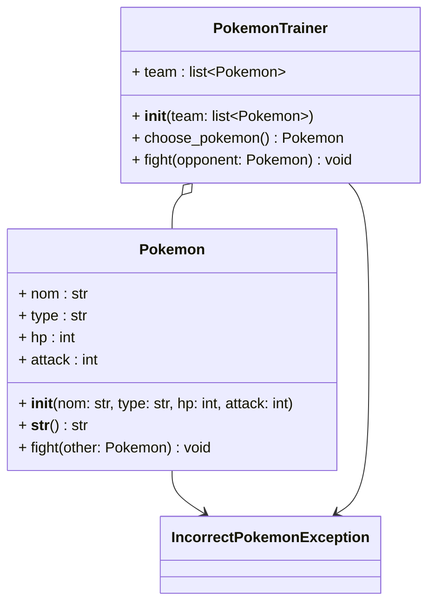
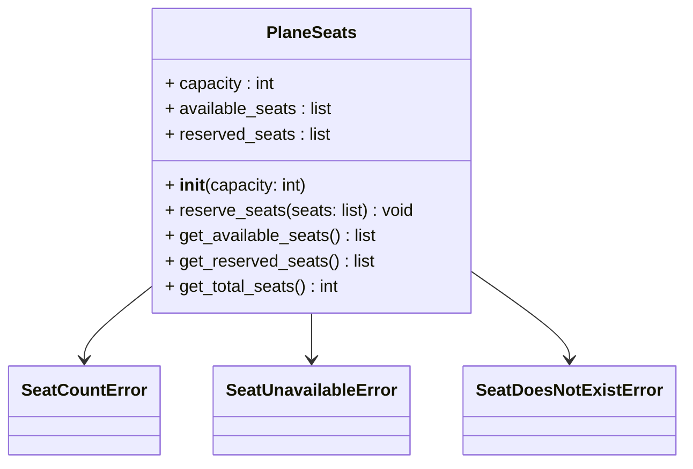
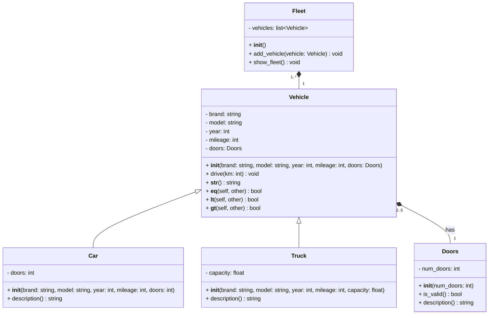
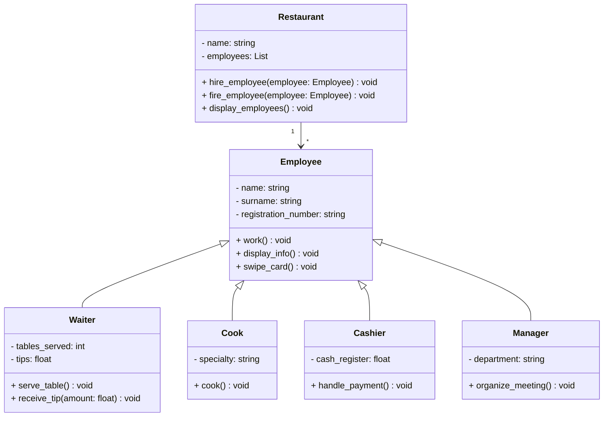

# Bonnes pratiques de développement

L'objectif de ce TP est de vous familiariser avec les bonnes pratiques de développement en Python. Vous allez apprendre à gérer les exceptions et à créer des tests unitaires pour valider le bon fonctionnement de votre code. Il est important de tester votre code pour vous assurer qu'il fonctionne correctement et pour anticiper les erreurs.

:warning: Veillez à mettre en pratique les bonnes pratiques de développement suivantes :

- **Gestion des exceptions** : utilisez des exceptions pour gérer les erreurs et les cas limites.
- **Tests unitaires** : créez des tests unitaires pour valider le bon fonctionnement de votre code.
- **Documentation** : documentez votre code pour expliquer son fonctionnement et son utilisation.
- **Type hints** : utilisez les annotations de type pour spécifier les types des paramètres et des valeurs de retour.

Tous ces éléments seront pris en compte dans le TP noté. :wink:

---

## Exercice 1 : polygones :triangular_ruler:

### Contexte

On veut représenter des figures géométriques :
- Un **point** est défini par ses coordonnées `x` et `y`.
- Un **segment** est défini par deux points.
- Un **triangle** est défini par trois points.

### Règles imposées

1. Un segment doit avoir deux points distincts, sinon une exception est levée. Créez une méthode pour calculer la longueur du segment.
2. Un triangle doit avoir trois points non alignés, sinon une exception est levée. Créez une méthode pour calculer l'aire et le périmètre du triangle.
3. La classe `GeometryUtils` (avec des méthodes de calcul) doit être **immuable**.

### TODO

1. Créez le diagramme de classes correspondant à ce contexte (sur papier ou sur [Draw.io](https://app.diagrams.net/)).
2. Créez la classe `Point` avec les attributs `x` et `y` (vous pouvez utiliser la classe du TP2).
3. Créez la classe `Segment` avec les attributs `p1` et `p2` de type `Point`.
4. Créez la classe `Triangle` avec les attributs `p1`, `p2` et `p3` de type `Point`.
5. Créez la classe `GeometryUtils` avec une méthode statique qui vérifie si trois points sont alignés.

Trois points sont alignés si l'aire du triangle formé par ces trois points est nulle.
Une autre méthode pour vérifier si trois points sont colinéaires est de vérifier si $$(x_{2} - x_{1}) \times (y_{3} - y_{2})$$ et $$(x_{3} - x_{1}) \times (y_{2} - y_{1})$$ sont égaux.

<!--

## Exercice 1 : polygones

Pour cet exercice, nous allons créer des polygones. Pour cela, nous avons besoin d'un point, vous pouvez réutiliser la classe `Point` du TP2.  

#### Contraintes à implémenter :  
- Un **polygone** est défini par une suite finie et ordonnée de points qu’on nomme **sommets** (pour simplifier, on supposera que les polygones sont convexes, sauf à la dernière question optionnelle).  
- On peut **calculer l’aire et le périmètre** d’un polygone.  
- Un polygone avec **2 sommets** est un **segment** dont le périmètre est la longueur du segment, et l’aire est nulle.  
- Deux sommets successifs (ainsi que les premier et dernier sommets) du polygone forment un **segment**, qu’on nomme un **côté du polygone**.  
- Un **triangle** est un polygone avec **3 sommets**.  
- L’aire d’un **triangle** peut être obtenue avec la formule de Héron : $$ S = \sqrt{p(p - a)(p - b)(p - c)} $$ avec $$ p = \frac{a+b+c}{2} $$ et $$ a, b, c $$ les longueurs de ses côtés.  
- Un **quadrilatère** est un polygone à **4 sommets** (on le supposera convexe – ses côtés ne se coupent pas).  
- L’aire d’un **quadrilatère** peut être obtenue en le divisant en deux triangles, et en sommant les aires de ces triangles.  
- Un **rectangle** est un **quadrilatère** dont les **côtés opposés sont de même longueur** et ayant un **angle droit** (condition suffisante car les quadrilatères sont supposés convexes).  
- L’aire d’un **rectangle** est le **produit des longueurs de deux côtés adjacents**.  

#### Travail à réaliser  

1. **Identifiez les classes, les attributs, les méthodes, les associations et les généralisations** dans l’énoncé ci-dessus. En d’autres termes, écrivez le **diagramme de classes**.  
2. **Implémentez votre diagramme de classe.** Vous veillerez à implémenter la méthode `__str__` (soit directement dans la classe, soit par héritage).  
3. **Écrivez un module `__main__.py`** avec des tests de votre code. 
4. On souhaite ajouter la création d’un **polygone régulier** tel que ses **sommets sont régulièrement espacés** sur un cercle dont le **centre et le rayon** sont donnés. L’angle par rapport à l’axe des abscisses du **premier sommet** est également fourni. **Modifiez votre diagramme de classe et votre code.**  
5. (**Surcharge d’opérateur**) **Surchargez l’addition** pour la classe `Segment` (méthode `__add__(self, x)`).  
   - Ajouter un **Point** donne un **Triangle**.  
   - Ajouter un **Segment** donne un **Quadrilatère** (on s’assurera que ses côtés ne se croisent pas).  
   - Ajouter un **Polygone** donnera un **nouveau polygone**.  
   - Vous pourrez utiliser la fonction `isinstance(x, Point)` pour tester si l’objet `x` appartient à la classe `Point`.  
6. Lors de la création d’un **polygone**, vérifiez que celui-ci est **bien convexe**, et **levez une exception** dans le cas contraire.  
   - Créez une nouvelle **exception** (dérivant de la classe de base `Exception`).  
   - Ajoutez cette classe au **diagramme de classe**.  

-->

## Exercice 2 : PokéTech Corp 🎮

**Contexte :**
Tu viens d’être embauché par la PokéTech Corp pour développer un simulateur de combat Pokémon !

Ta mission ? Implémenter un système de gestion de Pokémon avec des classes bien conçues, tester leur bon fonctionnement avec `unittest` et gérer les erreurs avec des exceptions personnalisées.

**Question 1** : Implémenter une classe `Pokemon` avec les attributs suivants :  
- `nom` : le nom du Pokémon.  
- `type` : le type élémentaire du Pokémon (ex: Feu, Eau, Plante).  
- `hp` : *hit points* qui correspondent aux points de vie (PV) du Pokémon qui doivent être ≥ 0.  
- `attack` : la puissance d’attaque du Pokémon (doit être ≥ 0).  

💡 **Exception à coder :** Créer une exception `IncorrectPokemonException` qui sera levée si les PV ou l’attaque sont négatifs.

Ajouter les méthodes suivantes :  
- `__str__()` : afficher les infos du Pokémon.  
- `fight(other: Pokemon)` : réduire les PV de l’autre Pokémon en fonction de l’attaque.  
- S’assurer que `hp` et `attack` sont positifs ; sinon lever une exception `IncorrectPokemonException`.

**Question 2** : Tests avec `unittest` :  
- Vérifier que la création d’un Pokémon avec une attaque ou des PV négatifs lève bien une exception.  
- Tester la méthode `fight()` en s’assurant que les PV sont bien réduits après un coup.  

**Question 3** : Ajouter une classe `PokemonTrainer` (dresseur) qui possède une équipe de Pokémon.
- Implémenter une méthode pour choisir un Pokémon et le faire combattre.  
- Gérer le cas où un Pokémon est KO avec une exception `IncorrectPokemonException`.

🧪 **À toi de jouer !** Teste ton code, corrige les erreurs et assure-toi que ton simulateur est digne d’un vrai dresseur Pokémon !

---

## Exercice 3 : réservation de places d'avion :airplane:

Vous devez écrire un programme qui permet de réserver des places dans un avion. Le programme doit permettre de réserver une place, de lister les places disponibles et de lister les places réservées.

**Question 1** : Définissez la classe `PlaneSeats` avec les attributs suivants :

- `capacity` : le nombre de places totales disponibles dans l’avion.
- `available_seats` : la liste des places disponibles (initialisée avec les numéros de places de 1 à `capacity`).
- `reserved_seats` : la liste des places déjà réservées (vide à l’initialisation).

**Question 2** : Créez une méthode `reserve_seats` prenant une liste de numéros de sièges en argument et devant avoir le comportement suivant :

- **Vérification du nombre de places disponibles** :
  - Si le nombre de places disponibles est inférieur au nombre de places demandées, lever une erreur du type `SeatCountError`.
- **Vérification de la disponibilité du siège** :
  - Si le siège est déjà réservé, lever une erreur du type `SeatUnavailableError`.
  - Sinon, ajouter le siège à la liste des places réservées.

**Question 3** : Créez une exception personnalisée `SeatDoesNotExistError` qui sera levée si un siège demandé n’existe pas dans l’avion.

**Question 4** : Modifiez la méthode `reserve_seats` de manière à ne réserver les places demandées que si l’ensemble des places demandées répondent aux conditions suivantes :

- Le nombre de places demandées n’excède pas le nombre de places disponibles.
- Toutes les places existent dans l’avion.
- Aucune des places demandées n’est déjà réservée.
- Dans le cas contraire, ne pas réserver de place.

**Question 5** : Créez une méthode `get_available_seats` permettant de lister les places disponibles dans l’avion.

**Question 6** : Créez une méthode `get_reserved_seats` permettant de lister les places déjà réservées dans l’avion.

**Question 7** : Créez une méthode `get_total_seats` permettant de connaître le nombre total de places dans l’avion.

**Question 8** : Créez un fichier principal `main.py` permettant d’interagir avec la classe `PlaneSeats` et de tester les différentes fonctionnalités.

- Créez une instance de la classe `PlaneSeats` contenant 20 places.
- Réservez 5 places : places 2, 5, 8, 10 et 15.
- Affichez les places disponibles.
- Réservez la place 5, cela doit lever une erreur `SeatUnavailableError`.
- Réservez 10 places : places 1, 3, 6, 7, 9, 11, 12, 16, 18 et 20.
- Réservez la place 21, cela doit lever une erreur `SeatDoesNotExistError`.
- Affichez les places réservées.
- Affichez le nombre total de places.

## Exercice 4 : simulation d'une flotte de véhicules

Cet exercice vise à modéliser une flotte de véhicules pour gérer différents types de véhicules.

:warning: **Attention** : Chaque classe doit être bien documentée avec des commentaires pour expliquer les attributs et les méthodes.

1. **Créer une classe `Vehicle`** (fichier `vehicle.py`) :

   - Cette classe représente un véhicule générique avec des attributs pour la marque, le modèle, l'année et le kilométrage.
   - Elle doit contenir une méthode `drive(km: int)` qui ajoute les kilomètres au kilométrage existant.
   - Elle doit contenir une méthode spéciale `__str__()` qui affiche les informations du véhicule.
       

2. **Créer deux sous-classes de `Vehicle`** (fichiers `car.py` et `truck.py`) :

   - **`Car`** :
     - Ajoute un attribut `doors` pour le nombre de portes.
     - Contient une méthode `description()` qui retourne une description spécifique.
   - **`Truck`** :
     - Ajoute un attribut `capacity` pour la capacité en tonnes.
     - Contient une méthode `description()` qui retourne une description spécifique.
         

3. **Créer une classe `Fleet`** (fichier `fleet.py`) :

   - Cette classe représente une flotte contenant une collection de véhicules.
   - Elle doit contenir une méthode `add_vehicle(vehicle: Vehicle)` pour ajouter un véhicule à la flotte.
   - Elle doit contenir une méthode `show_fleet()` pour afficher les informations de tous les véhicules.
       

4. **Créer une classe `Doors`** (fichier `doors.py`) :

   - Cette classe représente le nombre de portes d'un véhicule.
   - Attributs :
     - `num_doors` : un entier représentant le nombre de portes du véhicule, qui doit être compris entre 2 et 5.
   - Méthodes :
     - `is_valid()` : vérifie si le nombre de portes est valide (entre 2 et 5).
     - `description()` : retourne une description du nombre de portes du véhicule.
         

5. **Modifier la classe `Vehicle` pour inclure des portes** :

   - Ajoutez un attribut `doors` qui est une instance de la classe `Doors`.
   - Adaptez la méthode `__str__()` pour inclure les informations sur les portes en appelant `doors.description()`.
       

6. **Implémenter les méthodes spéciales pour comparer des véhicules** :

   - Ajoutez les méthodes suivantes dans la classe `Vehicle` :
     - `__eq__(self, other)` : permet de comparer l'égalité des véhicules en fonction du kilométrage.
     - `__lt__(self, other)` : permet de comparer si un véhicule a moins de kilométrage qu'un autre.
     - `__gt__(self, other)` : permet de comparer si un véhicule a plus de kilométrage qu'un autre.

7. **Créer un programme principal `main.py`** :

   - Créer les véhicules suivants :
     - Voiture 1 : Toyota, Corolla, 2018, 50000 km, 4 portes.
     - Voiture 2 : Honda, Civic, 2015, 80000 km, 2 portes.
     - Camion : Volvo, FH16, 2015, 120000 km, 25 tonnes.
   - Ajouter ces véhicules à une flotte.
   - Afficher les informations de tous les véhicules de la flotte.
   - Comparer les deux voitures en fonction de leur kilométrage (utiliser les méthodes `==`, `<`, `>`).
   - Simuler la conduite d'un véhicule en ajoutant des kilomètres au kilométrage de la voiture 1.
   - Afficher à nouveau les informations du véhicule après la conduite.

    
## Exercice 5 : gestion des employés d'un restaurant

Pauses Café est une chaîne de cafés qui souhaite gérer les employés de ses différents établissements.
Pour cela, Lola DUPUIS, la responsable des ressources humaines, vous demande de créer une application qui permettra de gérer les employés de la chaîne.

Dans les restaurants, il y a des serveurs, des cuisiniers, des caissiers, des managers. Chaque employé a des attributs et des comportements spécifiques.

**Question 1.** Créer une classe `Employee` (fichier `employee.py`) qui définit les attributs suivants :

- `name` : le prénom de l'employé
- `surname` : le nom de famille de l'employé
- `registration_number` : le matricule de l'employé

**Question 2.** Ajouter les méthodes suivantes à la classe `Employee` :

- `work()` : affiche un message indiquant que l'employé est en train de travailler
- `display_info()` : affiche les informations de l'employé (nom, prénom, matricule)
- `swipe_card()` : affiche un message indiquant que l'employé a badgé

**Question 3.** Créer la classe `Waiter` (fichier `waiter.py`) qui hérite de la classe `Employee` et ajoute un attribut `tables_served` et une méthode `serve_table()` qui affiche un message indiquant que le serveur est en train de servir une table. Un serveur peut également recevoir des pourboires, créer une méthode `receive_tips()` qui affiche un message indiquant que le serveur a reçu un pourboire et calcule le montant total des pourboires reçus.

**Question 4.** Créer la classe `Cook` (fichier `cook.py`) qui hérite de la classe `Employee` et ajoute un attribut `specialty` et une méthode `cook()` qui affiche un message indiquant que le cuisinier est en train de cuisiner.

**Question 5.** Créer la classe `Cashier` (fichier `cashier.py`) qui hérite de la classe `Employee` et ajoute un attribut `cash_register` et une méthode `handle_payment()` qui affiche un message indiquant que le caissier est en train de gérer un paiement.

**Question 6.** Créer la classe `Manager` (fichier `manager.py`) qui hérite de la classe `Employee` et ajoute un attribut `department` et une méthode `organize_meeting()` qui affiche un message indiquant que le manager est en train d'organiser une réunion.

**Question 7.** Créer la classe `Restaurant` (fichier `restaurant.py`) qui permet de gérer les employés du restaurant.

- Un restaurant possède un nom et une liste d'employés.
- Ajouter une méthode `hire_employee()` qui permet d'embaucher un employé.
- Ajouter une méthode `fire_employee()` qui permet de licencier un employé.
- Ajouter une méthode `display_employees()` qui permet d'afficher la liste des employés du restaurant.

**Question 8.** Créer un programme principal (fichier `main.py`) qui permet de tester les différentes classes et méthodes.

- Créer plusieurs employés de différents types (serveurs, cuisiniers, caissiers, managers).
- Créer un restaurant.
- Ajouter les employés au restaurant.
- Afficher les informations des employés du restaurant.
- Tester les méthodes spécifiques à chaque type d'employé.
- Licencier un employé.