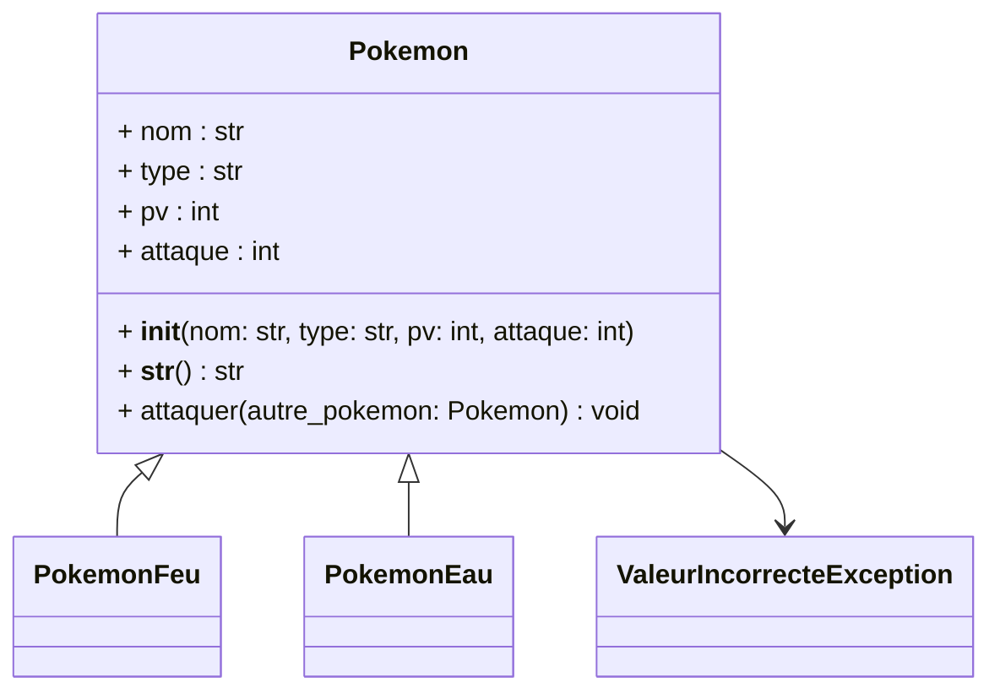
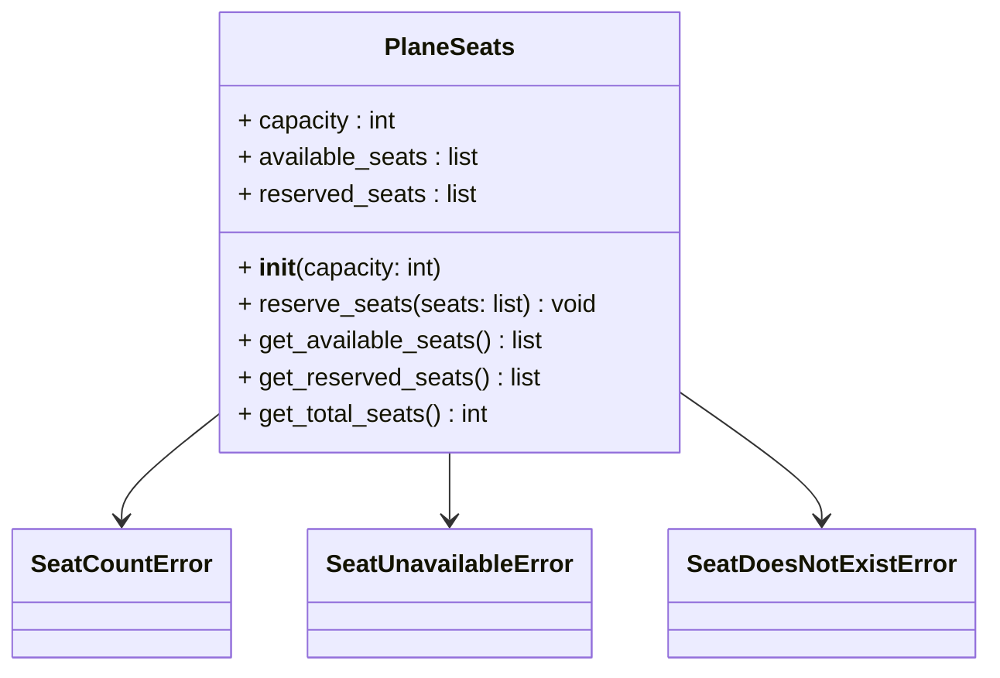

## Gestion des exceptions

L'objectif de ce TP est de vous familiariser avec la gestion des exceptions en Python. Pour cela, nous allons créer des classes d'exceptions personnalisées et les utiliser dans un programme de réservation de places d'avion.

### Exercice 1 : création de Pokémon 

**Contexte :**
Tu viens d’être embauché par la PokéTech Corp pour développer un simulateur de combat Pokémon en Python !
Ta mission ? Implémenter un système de gestion de Pokémon avec des classes bien conçues, tester leur bon fonctionnement avec `unittest` et gérer les erreurs avec des exceptions custom.

**Partie 1 : Création des classes Pokémon**

Implémente une classe `Pokemon` avec les attributs suivants :  
- `nom` (str) : le nom du Pokémon.  
- `type` (str) : le type élémentaire du Pokémon (ex: "Feu", "Eau", "Plante").  
- `pv` (int) : les points de vie du Pokémon (doivent être ≥ 0).  
- `attaque` (int) : la puissance d’attaque du Pokémon (doit être ≥ 0).  

Ajoute les méthodes suivantes :  
- `__str__()` : affiche les infos du Pokémon sous forme lisible.  
- `attaquer(autre_pokemon)` : réduit les PV de l’autre Pokémon en fonction de l’attaque.  
- Une vérification pour s’assurer que `pv` et `attaque` sont positifs (sinon, lève une exception `ValeurIncorrecteException`).  

💡 **Exception à coder :**  
Crée une exception `ValeurIncorrecteException` qui sera levée si les PV ou l’attaque sont négatifs.  

**Partie 2 : Héritage et Pokémon spéciaux**

Crée deux sous-classes :  
- `PokemonFeu` qui ajoute un bonus de +10 en attaque.  
- `PokemonEau` qui réduit les dégâts subis de 10%.  

**Astuce :** Utilise `super()` pour réutiliser le constructeur de `Pokemon` !

**Partie 3 : Test avec `unittest`**

Réalise une série de tests avec `unittest` :  
- Vérifie que la création d’un Pokémon avec une attaque ou des PV négatifs lève bien une exception.  
- Teste la méthode `attaquer()` en s’assurant que les PV sont bien réduits après un coup.  
- Vérifie que les bonus/malus des sous-classes sont bien appliqués.  

**Partie 4 : Bonus (si t’es un vrai dresseur Pokémon)**

Ajoute une classe `Dresseur` qui peut posséder une équipe de Pokémon (une liste).  
- Implémente une méthode pour choisir un Pokémon et le faire combattre.  
- Gère les cas où un Pokémon est KO (PV = 0).  

🧪 **À toi de jouer !** Teste ton code, corrige les erreurs et assure-toi que ton simulateur est digne d’un vrai dresseur Pokémon ! 🎮🔥

### Exercice 2 : réservation de places d'avion

Vous devez écrire un programme qui permet de réserver des places dans un avion. Le programme doit permettre de réserver une place, de lister les places disponibles et de lister les places réservées.

**Question 1** : Définissez la classe `PlaneSeats` avec les attributs suivants :

- `capacity` : le nombre de places totales disponibles dans l’avion.
- `available_seats` : la liste des places disponibles (initialisée avec les numéros de places de 1 à `capacity`).
- `reserved_seats` : la liste des places déjà réservées (vide à l’initialisation).

**Question 2** : Créez une méthode `reserve_seats` prenant une liste de numéros de sièges en argument et devant avoir le comportement suivant :

- **Vérification du nombre de places disponibles** :
  - Si le nombre de places disponibles est inférieur au nombre de places demandées, lever une erreur du type `SeatCountError`.
- **Vérification de la disponibilité du siège** :
  - Si le siège est déjà réservé, lever une erreur du type `SeatUnavailableError`.
  - Sinon, ajouter le siège à la liste des places réservées.

**Question 3** : Créez une exception personnalisée `SeatDoesNotExistError` qui sera levée si un siège demandé n’existe pas dans l’avion.

**Question 4** : Modifiez la méthode `reserve_seats` de manière à ne réserver les places demandées que si l’ensemble des places demandées répondent aux conditions suivantes :

- Le nombre de places demandées n’excède pas le nombre de places disponibles.
- Toutes les places existent dans l’avion.
- Aucune des places demandées n’est déjà réservée.
- Dans le cas contraire, ne pas réserver de place.

**Question 5** : Créez une méthode `get_available_seats` permettant de lister les places disponibles dans l’avion.

**Question 6** : Créez une méthode `get_reserved_seats` permettant de lister les places déjà réservées dans l’avion.

**Question 7** : Créez une méthode `get_total_seats` permettant de connaître le nombre total de places dans l’avion.

**Question 8** : Créez un fichier principal `main.py` permettant d’interagir avec la classe `PlaneSeats` et de tester les différentes fonctionnalités.

- Créez une instance de la classe `PlaneSeats` contenant 20 places.
- Réservez 5 places : places 2, 5, 8, 10 et 15.
- Affichez les places disponibles.
- Réservez la place 5, cela doit lever une erreur `SeatUnavailableError`.
- Réservez 10 places : places 1, 3, 6, 7, 9, 11, 12, 16, 18 et 20.
- Réservez la place 21, cela doit lever une erreur `SeatDoesNotExistError`.
- Affichez les places réservées.
- Affichez le nombre total de places.

<!--

### Exercice 3 : polygones

Pour cet exercice, nous allons créer des polygones. Pour cela, nous avons besoin d'un point, vous pouvez réutiliser la classe `Point` du TP2.  

#### Contraintes à implémenter :  
- Un **polygone** est défini par une suite finie et ordonnée de points qu’on nomme **sommets** (pour simplifier, on supposera que les polygones sont convexes, sauf à la dernière question optionnelle).  
- On peut **calculer l’aire et le périmètre** d’un polygone.  
- Un polygone avec **2 sommets** est un **segment** dont le périmètre est la longueur du segment, et l’aire est nulle.  
- Deux sommets successifs (ainsi que les premier et dernier sommets) du polygone forment un **segment**, qu’on nomme un **côté du polygone**.  
- Un **triangle** est un polygone avec **3 sommets**.  
- L’aire d’un **triangle** peut être obtenue avec la formule de Héron : $$ S = \sqrt{p(p - a)(p - b)(p - c)} $$ avec $$ p = \frac{a+b+c}{2} $$ et $$ a, b, c $$ les longueurs de ses côtés.  
- Un **quadrilatère** est un polygone à **4 sommets** (on le supposera convexe – ses côtés ne se coupent pas).  
- L’aire d’un **quadrilatère** peut être obtenue en le divisant en deux triangles, et en sommant les aires de ces triangles.  
- Un **rectangle** est un **quadrilatère** dont les **côtés opposés sont de même longueur** et ayant un **angle droit** (condition suffisante car les quadrilatères sont supposés convexes).  
- L’aire d’un **rectangle** est le **produit des longueurs de deux côtés adjacents**.  

#### Travail à réaliser  

1. **Identifiez les classes, les attributs, les méthodes, les associations et les généralisations** dans l’énoncé ci-dessus. En d’autres termes, écrivez le **diagramme de classes**.  
2. **Implémentez votre diagramme de classe.** Vous veillerez à implémenter la méthode `__str__` (soit directement dans la classe, soit par héritage).  
3. **Écrivez un module `__main__.py`** avec des tests de votre code. 
4. On souhaite ajouter la création d’un **polygone régulier** tel que ses **sommets sont régulièrement espacés** sur un cercle dont le **centre et le rayon** sont donnés. L’angle par rapport à l’axe des abscisses du **premier sommet** est également fourni. **Modifiez votre diagramme de classe et votre code.**  
5. (**Surcharge d’opérateur**) **Surchargez l’addition** pour la classe `Segment` (méthode `__add__(self, x)`).  
   - Ajouter un **Point** donne un **Triangle**.  
   - Ajouter un **Segment** donne un **Quadrilatère** (on s’assurera que ses côtés ne se croisent pas).  
   - Ajouter un **Polygone** donnera un **nouveau polygone**.  
   - Vous pourrez utiliser la fonction `isinstance(x, Point)` pour tester si l’objet `x` appartient à la classe `Point`.  
6. Lors de la création d’un **polygone**, vérifiez que celui-ci est **bien convexe**, et **levez une exception** dans le cas contraire.  
   - Créez une nouvelle **exception** (dérivant de la classe de base `Exception`).  
   - Ajoutez cette classe au **diagramme de classe**.  

-->