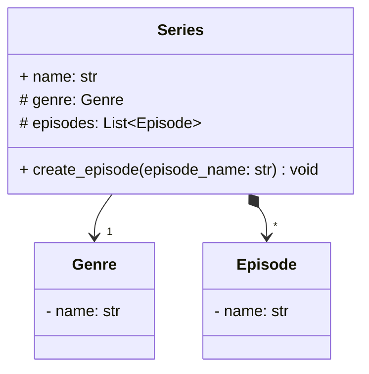
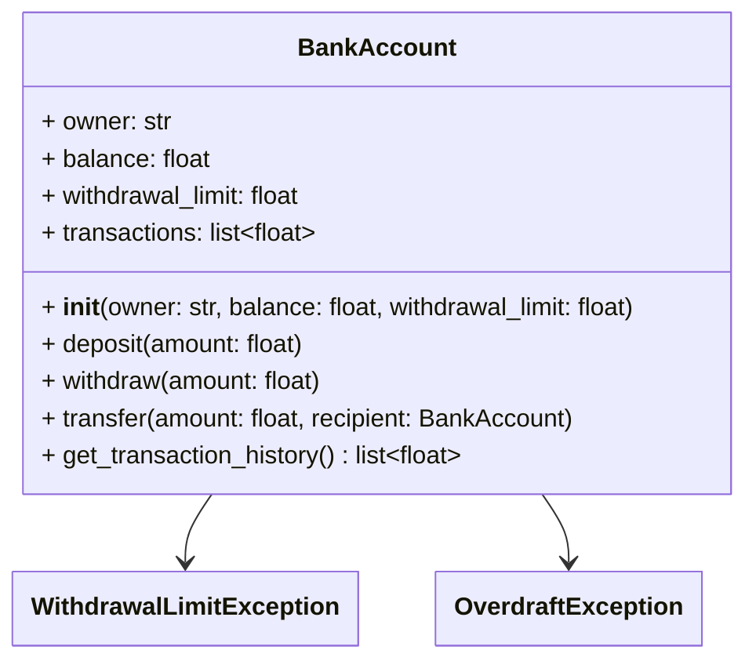
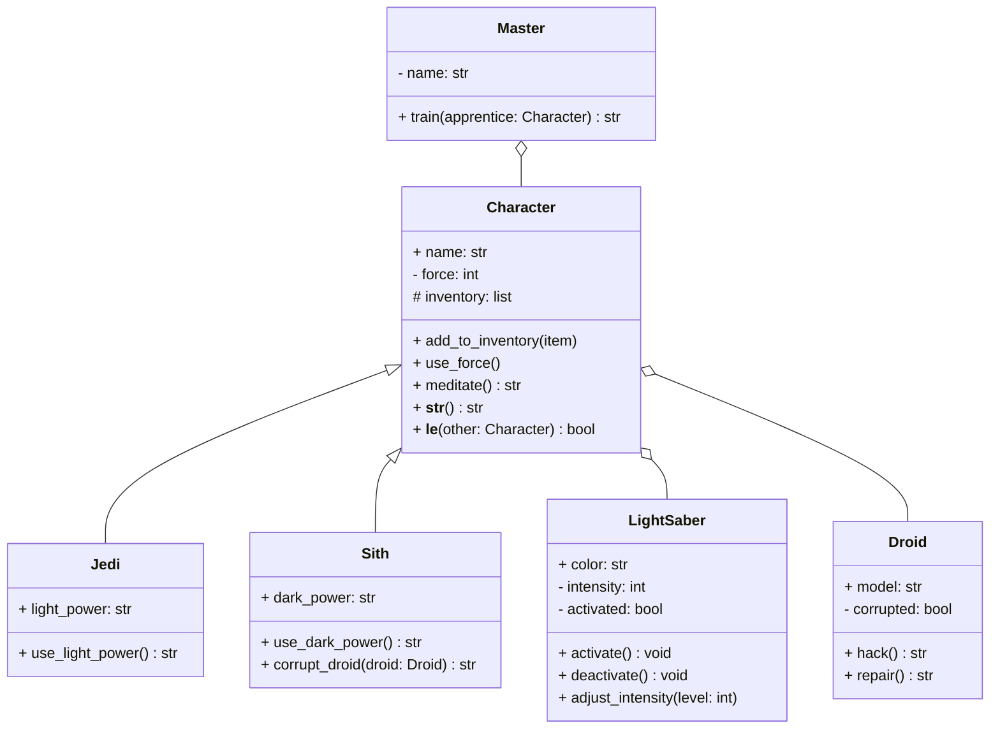

# Révisions

> :warning: Bonnes pratiques de développement
>
> Veillez à mettre en pratique les bonnes pratiques de développement suivantes :
> - **Gestion des exceptions** : utilisez des exceptions pour gérer les erreurs et les cas limites.
> - **Tests unitaires** : créez des tests unitaires pour valider le bon fonctionnement de votre code.
> - **Documentation** : documentez votre code pour expliquer son fonctionnement et son utilisation.
> - **Type hints** : utilisez les annotations de type pour spécifier les types des paramètres et des valeurs de retour.
>
> Tous ces éléments seront pris en compte dans le TP noté. :wink:
{: .block-warning }

## Exercice 1 : catalogue de séries

Tu es embauché par une entreprise de streaming pour développer un système de gestion de séries. Le code doit modéliser les séries, les saisons et les épisodes, comme définit dans le diagramme de classes suivant :

1. Créer les classes `Genre`, `Episode` et `Series` en respectant le diagramme de classes ci-dessus.
2. Ajouter une méthode `create_episode` à la classe `Series` pour ajouter un épisode à la série.
3. Créer un fichier `main.py` en créant la série "Friends" en créant 3 épisodes :
   - The One Where Monica Gets a Roommate
   - The One with the Sonogram at the End
   - The One with the Thumb
4. Faire des tests unitaires pour valider le bon fonctionnement de votre code.

## Exercice 2 : Gestion d’un compte bancaire sécurisé 🏦

Tu travailles pour une banque en ligne qui souhaite sécuriser ses transactions et éviter les fraudes. On te confie la mission de développer une classe `BankAccount` qui gère les comptes bancaires en respectant les règles suivantes :  

- Chaque compte a un **solde** et un **plafond de retrait**.  
- On doit pouvoir **déposer**, **retirer** et **transférer de l’argent** entre comptes.  
- Si un retrait dépasse le plafond, une **exception** est levée.  
- Si un compte tombe à **découvert**, une exception est levée.  
- Des **tests unitaires** valident le bon fonctionnement du système.

### Attributs
- `owner` → Nom du propriétaire du compte  
- `balance` → Solde du compte  
- `withdrawal_limit` → Montant maximum qu’on peut retirer en une seule fois  
- `transactions` → Historique des transactions  

### Méthodes
- `deposit(amount: float)` → Ajouter un montant au solde  
- `withdraw(amount: float)` → Retirer un montant (en respectant le plafond et en évitant le découvert)  
- `transfer(amount: float, recipient: BankAccount)` → Transférer de l’argent entre comptes  
- `get_transaction_history()` → Retourner la liste des transactions  

### Exceptions Personnalisées  
- `OverdraftException` → Levée si un retrait met le compte à découvert  
- `WithdrawalLimitException` → Levée si un retrait dépasse la limite autorisée  

### 🔥 Challenge Bonus  
🔹 Ajouter un système de sécurité qui demande un code PIN avant chaque transaction et bloque le compte après 3 erreurs.  
🔹 Ajouter des intérêts qui s’appliquent automatiquement chaque mois.  

## Exercice 3 : L’Académie des Jedi 🛡️  
 
Dans une galaxie lointaine, très lointaine... la guerre entre les Jedi et les Sith fait rage.  
Mais une nouvelle menace surgit : une rébellion de droïdes qui se retournent contre leurs maîtres !  

Les Jedi et les Sith devront utiliser **la force**, leur **sabre laser** et leurs **pouvoirs uniques** pour triompher.  
Mais attention, abuser de la force peut vous laisser **sans énergie** au pire moment...  

### Sabre laser

Chaque Jedi ou Sith possède un **sabre laser** de couleur unique.  
Le sabre peut être **activé/désactivé** et son **intensité ajustée** (entre 1 et 10).  

**Attributs :**  
- `color` → Couleur du sabre  
- `intensity` → Intensité du sabre (1 à 10, valeur par défaut : 5)  
- `activated`  → État du sabre  

**Méthodes :**  
- `activate()` → Allume le sabre  
- `deactivate()` → Éteint le sabre  
- `adjust_intensity(level: int)` → Ajuste l’intensité (uniquement entre 1 et 10)  

### Personnages

Un personnage a un **nom**, une **quantité de force**, un **sabre laser** et un **inventaire** d’objets (classe abstraite).  

**Attributs :**  
- `name` → Nom du personnage 
- `force` → Quantité de force (protégé)  
- `inventory` → Inventaire (privé) 
- `sabre` → Son sabre laser  

**Méthodes :**  
- `add_to_inventory(item: str)` → Ajoute un objet à l’inventaire  
- `use_force()` (abstraite) → Utilise la force  
- `meditate()` → Regagne de la force (+20)  

### Jedi et Sith  

Un Jedi et un Sith peuvent utiliser la force différemment :  

**Jedi** :  
- `light_power` → Pouvoir lumineux (ex. "Soin de force")  
- `use_light_power()` → Utilise un pouvoir lumineux (consomme 25 de force)  

**Sith** :  
- `dark_power` (str) → Pouvoir obscur (ex. "Éclair Sith")  
- `use_dark_power()` → Utilise un pouvoir obscur (consomme 25 de force)  
- `corrupt_droid(droid: Droid)` → Corrompt un droïde pour qu’il se retourne contre ses alliés  

### Décorateur  

Certains pouvoirs (ex. utiliser la force, pouvoir lumineux/obscur) doivent **consommer de la force**.  
Créer un décorateur `force_required` qui vérifie si un personnage a assez de force pour utiliser un pouvoir.

Si un personnage n’a plus assez de force, une exception `NotEnoughForceError` doit être levée.  

### 🔥 Challenge Bonus  
🔹 Ajout du sabre laser avec gestion d’activation/désactivation/intensité.  
🔹 Tests unitaires améliorés.  