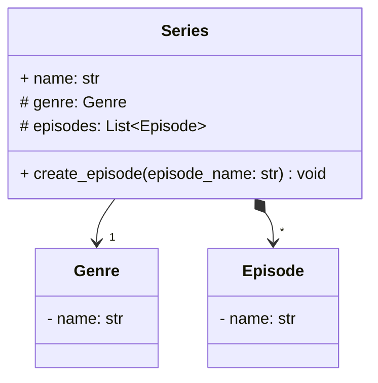
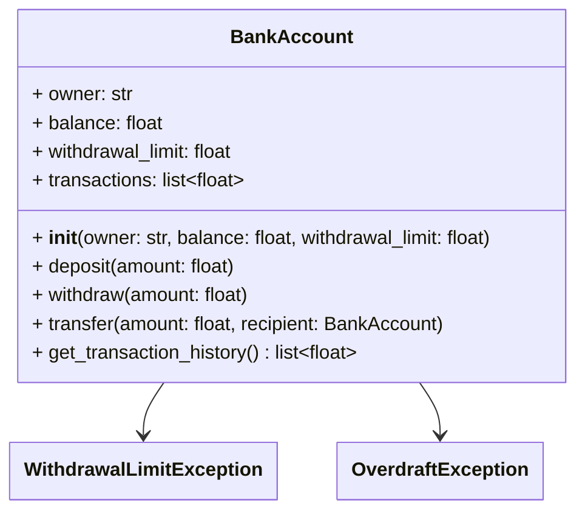
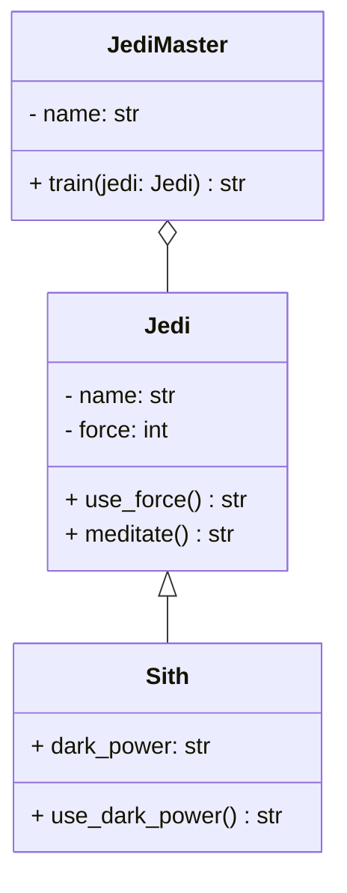

# Révisions

> :warning: Bonnes pratiques de développement
>
> Veillez à mettre en pratique les bonnes pratiques de développement suivantes :
> - **Gestion des exceptions** : utilisez des exceptions pour gérer les erreurs et les cas limites.
> - **Tests unitaires** : créez des tests unitaires pour valider le bon fonctionnement de votre code.
> - **Documentation** : documentez votre code pour expliquer son fonctionnement et son utilisation.
> - **Type hints** : utilisez les annotations de type pour spécifier les types des paramètres et des valeurs de retour.
>
> Tous ces éléments seront pris en compte dans le TP noté. :wink:
{: .block-warning }

## Exercice 1 : catalogue de séries

Tu es embauché par une entreprise de streaming pour développer un système de gestion de séries. Le code doit modéliser les séries, les saisons et les épisodes, comme définit dans le diagramme de classes suivant :

1. Créer les classes `Genre`, `Episode` et `Series` en respectant le diagramme de classes ci-dessus.
2. Ajouter une méthode `create_episode` à la classe `Series` pour ajouter un épisode à la série.
3. Créer un fichier `main.py` en créant la série "Friends" en créant 3 épisodes :
   - The One Where Monica Gets a Roommate
   - The One with the Sonogram at the End
   - The One with the Thumb
4. Faire des tests unitaires pour valider le bon fonctionnement de votre code.

## Exercice 2 : Gestion d’un compte bancaire sécurisé 🏦

Tu travailles pour une banque en ligne qui souhaite sécuriser ses transactions et éviter les fraudes. On te confie la mission de développer une classe `BankAccount` qui gère les comptes bancaires en respectant les règles suivantes :  

- Chaque compte a un **solde** et un **plafond de retrait**.  
- On doit pouvoir **déposer**, **retirer** et **transférer de l’argent** entre comptes.  
- Si un retrait dépasse le plafond, une **exception** est levée.  
- Si un compte tombe à **découvert**, une exception est levée.  
- Des **tests unitaires** valident le bon fonctionnement du système.

### 1️⃣ Attributs
- `owner` → Nom du propriétaire du compte  
- `balance` → Solde du compte  
- `withdrawal_limit` → Montant maximum qu’on peut retirer en une seule fois  
- `transactions` → Historique des transactions  

### 2️⃣ Méthodes
- `deposit(amount: float)` → Ajouter un montant au solde  
- `withdraw(amount: float)` → Retirer un montant (en respectant le plafond et en évitant le découvert)  
- `transfer(amount: float, recipient: BankAccount)` → Transférer de l’argent entre comptes  
- `get_transaction_history()` → Retourner la liste des transactions  

### 3️⃣ Exceptions Personnalisées  
- `OverdraftException` → Levée si un retrait met le compte à découvert  
- `WithdrawalLimitException` → Levée si un retrait dépasse la limite autorisée  

### 🔥 Challenge Bonus  
🔹 Ajouter un système de sécurité qui demande un code PIN avant chaque transaction et bloque le compte après 3 erreurs.  
🔹 Ajouter des intérêts qui s’appliquent automatiquement chaque mois.  

<!--

## Exercice 3 : L’Académie des Jedi 🛡️  

### 🎯 Objectifs

Bienvenue à **l’Académie des Jedi**, où de jeunes Padawans apprennent à maîtriser la force sous la guidance de leur Maître Jedi. Chaque Jedi possède des compétences uniques et doit gérer son énergie pour utiliser la Force. Cependant, certains pouvoirs sont immuables et ne peuvent pas être modifiés une fois définis !  

Tu devras utiliser :  
✅ **Héritage** → Pour gérer les Jedi et Sith  
✅ **Associations** → Pour lier un Padawan à son Maître Jedi  
✅ **Décorateurs** → Pour limiter l’usage de la Force et marquer certains pouvoirs comme **final**  
✅ **Exceptions** → Pour gérer l’épuisement de la Force  
✅ **Tests unitaires** → Pour s’assurer du bon fonctionnement  

### 🔥 Challenge Bonus
🔹 Ajoute un autre Sith qui a un pouvoir différent du Côté Obscur.  
🔹 Crée un duel entre deux Sith ou un Sith contre un Jedi.  
🔹 Ajoute une régénération automatique après un certain temps.

-->