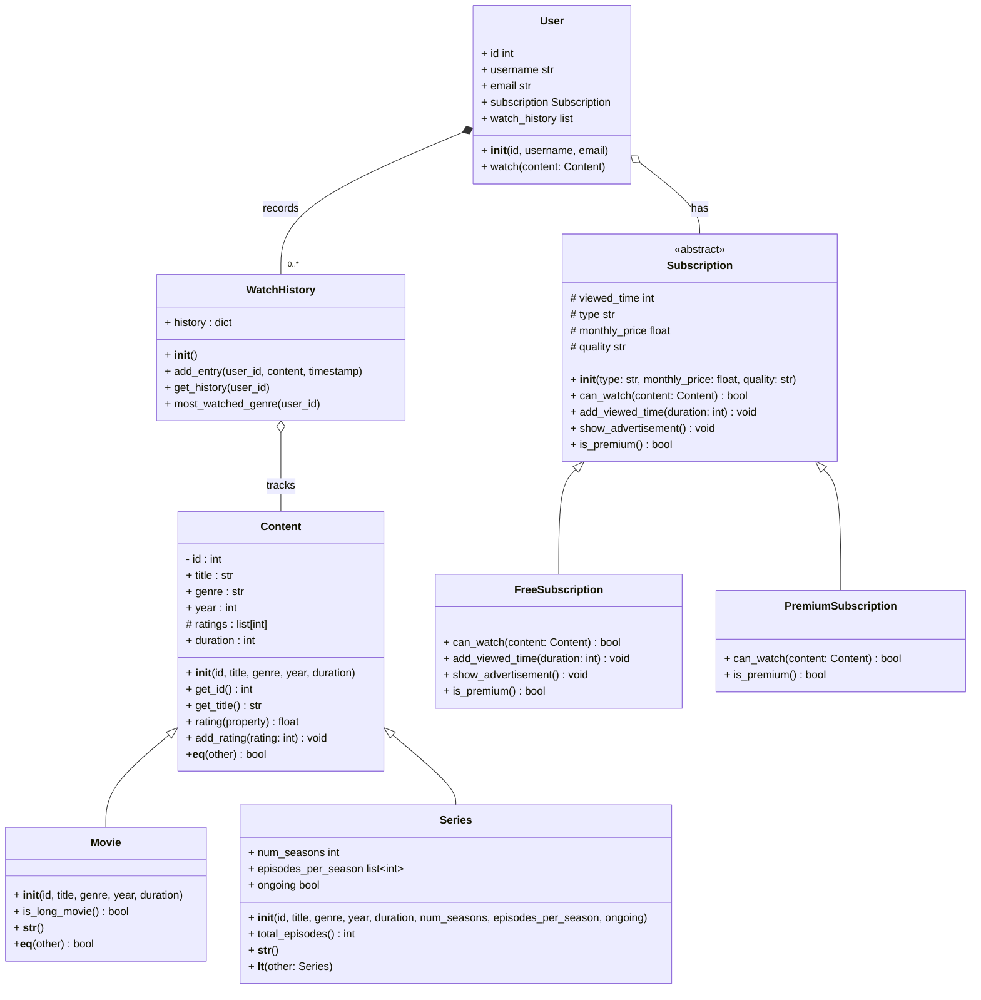
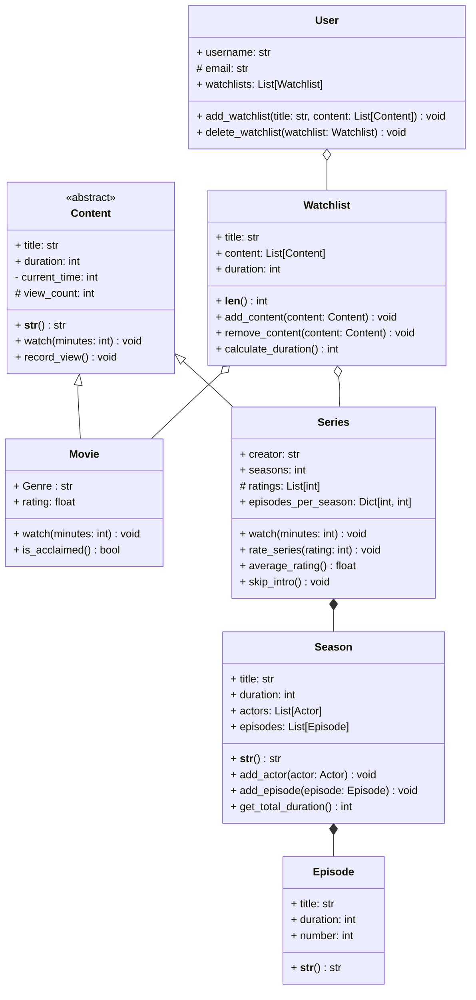
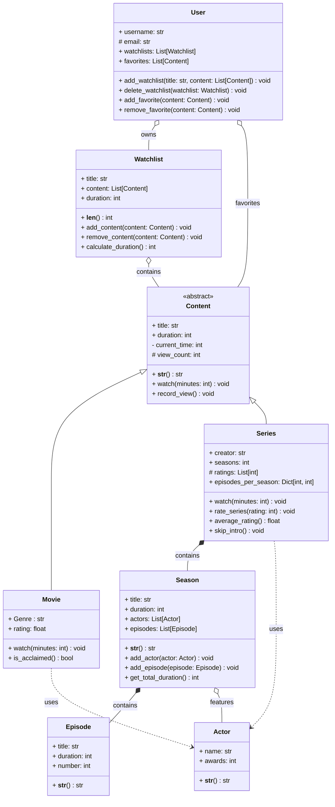

# Examen

**Durée de l'examen : 3h**

> #### :stopwatch: Tiers temps
>
> Les élèves bénéficiant d'un tiers temps sont dispensés de faire les classes `PremiumSubscription` et `FreeSubscription`.
>
{: .block-example }

> #### :exclamation: Consignes
>
> L'accès à Internet est autorisé pour **consulter la documentation Python**. Il est **interdit de communiquer** avec d'autres personnes ou d'**utiliser des outils d'Intelligence Artificielle** tels que ChatGPT. **En cas de triche, la note de 0 sera attribuée.**
>
{: .block-danger }

> #### :information_source: Barème
>
> Les conventions de nommage ainsi que toutes les règles de bonnes pratiques seront prises en compte dans la notation. Au moins une classe doit être complètement documentée.
>
{: .block-warning }

## :movie_camera: Gestion d'un système de films et de séries

Alexandra Chen, directrice technique de StreamFlow Studios, vous demande de créer une application de gestion de films et de séries. Cette application doit pouvoir gérer le visionnage des films, des séries ainsi que leurs évaluations. Vous êtes développeur.se au sein de SteamFlow Studios. Vous devez implémenter un système orienté objet pour gérer les contenus, les utilisateurs et les abonnements.

StreamFlix propose deux types d'abonnements :
- Gratuit : contenu avec publicités, qualité standard
- Premium : contenu sans publicité, haute qualité

### Objectifs

Vous devez concevoir et implémenter un système orienté objet qui permettra de :

1. Gérer différents types de contenus (films et séries)
2. Gérer les abonnements des utilisateurs 
3. Gérer les visionnages
4. Implémenter des tests unitaires

### Documentation des classes

**Contenus**

| Attribut/Méthode                             | Description                                        |
|----------------------------------------------|----------------------------------------------------|
| `id`                                         | Identifiant du film                                |
| `title`                                      | Titre du contenu                                   |
| `genre`                                      | Genre du contenu.                                  
| `year`	                                      | Année de sortie.                                   |             
| `ratings`	                                   | Liste des évaluations du contenu.                  |  
| `duration`	                                  | Durée du contenu en minutes.                       |
| `__init__(id, title, genre, year, duration)` | 	Constructeur de la classe Content.                |
| `get_id()`                                   | 	Retourne l'identifiant du contenu.                |
| `get_title()`	                               | Retourne le titre du contenu.                      |
| `rating (property)`                          | 	Propriété calculée renvoyant la note moyenne.     |
| `add_rating(rating: int)`                    | 	Ajoute une évaluation au contenu. La note doit être comprise entre 1 et 10, sinon une exception `InvalidRatingError` doit être levée.                |
| `__eq__(other)`                              | 	Compare si deux contenus ont le même identifiant. |

---

**Films**

| Attribut/Méthode                             | Description                                                     |
|----------------------------------------------|-----------------------------------------------------------------|
| `__init__(id, title, genre, year, duration)` | Constructeur de la classe Movie.                                |
| `is_long_movie()`                            | Indique si le film est dure plus de 2 heures (120 minutes).     |
| `__str__()`                                  | Retourne une représentation textuelle de l'objet Movie.         |
| `__eq__(other)`	                             | Compare si deux films ont le même ID et même titre.             |

---

**Séries**

| Attribut/Méthode                                                                        | Description                                               |
|-----------------------------------------------------------------------------------------|-----------------------------------------------------------|
| `num_seasons`                                                                           | 	Nombre de saisons.                                       |
| `episodes_per_season`                                                                   | 	Liste du nombre d'épisodes par saison.                   |
| `ongoing`                                                                               | 	Indique si la série est toujours en cours.               |
| `__init__(id, title, genre, year, duration, num_seasons, episodes_per_season, ongoing)` | 	Constructeur de la classe Series.                        |
| `total_episodes()`                                                                      | 	Calcule le nombre total d'épisodes.                      |
| `__str__()`                                                                             | 	Retourne une représentation textuelle de l'objet Series. |
| `__lt__(other: Series)`                                                                 | 	Compare quelle série est la plus longue.                 |

---

**Abonnements**

La classe `Subscription` définit les méthodes et attributs communs à tous les abonnements.

| Attribut/Méthode | Description |
|-----------------|-------------|
| `viewed_time` | Temps de visionnage cumulé en minutes |
| `__init__()` | Constructeur initialisant le temps de visionnage à 0 |
| `can_watch(content: Content) -> bool` | Méthode abstraite déterminant si un média peut être visionné |
| `add_viewing_time(duration: int)` | Méthode ajoutant du temps au compteur de visionnage |
| `show_advertisement()` | Méthode gérant l'affichage des publicités |
| `is_premium() -> bool` | Méthode abstraite indiquant si l'abonnement est premium |

---

**Abonnement gratuit**

La classe `FreeSubscription` définit les méthodes et attributs spécifiques à l'abonnement gratuit. Un abonnement gratuit a une limite de temps de visionnage de 2 heures (120 minutes) par mois.

| Attribut/Méthode | Description                                                             |
|------------------|-------------------------------------------------------------------------|
| `can_watch(content: Content) -> bool` | Vérifie si le temps cumulé + la durée du média ne dépasse pas la limite |
| `add_viewing_time(duration: int)` | Ajoute la durée du média visionné au compteur de temps                  |
| `show_advertisement()` | Affiche une publicité (texte) pour l'abonnement premium                 |
| `is_premium() -> bool` | Retourne toujours `False` car c'est un abonnement gratuit               |

---

**Abonnement premium**

La classe `PremiumSubscription` définit les méthodes et attributs spécifiques à l'abonnement premium.

| Attribut/Méthode | Description |
|------------------|-------------|
| `can_watch(content: Content) -> bool` | Retourne toujours `True` car aucune limite de temps pour les abonnés premium |
| `add_viewing_time(duration: int)` | Ne fait rien car pas de limite de temps pour les abonnements premium |
| `show_advertisement()` | Ne fait rien car pas de publicités pour les abonnements premium |
| `is_premium() -> bool` | Retourne toujours `True` car c'est un abonnement premium |

---

**Historique**

La classe `WatchHistory` permet de stocker les contenus visionnés par les utilisateurs.

| Attribut/Méthode | Description |
|------------------|-------------|
| `history` | Dictionnaire stockant les contenus visionnés par les utilisateurs |
| `__init__()` | Constructeur initialisant l'historique |
| `add_entry(user_id, content, timestamp)` | Ajoute une entrée à l'historique |
| `get_history(user_id)` | Retourne l'historique d'un utilisateur |
| `most_watched_genre(user_id)` | Retourne le genre le plus visionné par un utilisateur |

---

**Utilisateurs**

Un utilisateur dispose d'un abonnement et d'un historique.

| Attribut/Méthode | Description                                                                      |
|------------------|----------------------------------------------------------------------------------|
| `id` | Identifiant de l'utilisateur                                                     |
| `username` | Nom d'utilisateur                                                                |
| `email` | Adresse email                                                                    |
| `subscription` | Abonnement de l'utilisateur                                                      |
| `watch_history` | Historique de visionnage de l'utilisateur                                        |
| `__init__(id, username, email)` | Constructeur de la classe User                                                   |
| `watch(content: Content)` | Méthode permettant à l'utilisateur de visionner un contenu (cf note ci-dessous). |

---

Lorsqu'un utilisateur regarde un contenu, le programme doit vérifier qu'il peut le regarder en fonction de son abonnement. Si l'utilisateur a un abonnement gratuit, il ne peut regarder que les contenus dont la durée totale ne dépasse pas 120 minutes par mois. Si l'utilisateur a un abonnement premium, il n'y a pas de limite de temps.

Pour les utilisateurs avec un abonnement gratuit, une publicité s'affiche au début du visionnage. Ensuite, le programme affiche le message "Nom de l'utilisateur is watching Nom du contenu". L'utilisateur peut regarder le contenu et l'ajouter à son historique. La durée du contenu est ajoutée au temps de visionnage de l'utilisateur. Dans le cas contraire, une exception `AccessDeniedException` est levée si l'utilisateur a dépassé son quota de visionnage mensuel. Une exception `TimeLimitExceededException` est levée si le contenu dépasse la limite de temps autorisée.

---

### Programme principal

Créer un fichier main avec :
- Film Inception (Identifiant : `7882`, Genre : Sci-Fi, Année : 2010, Durée : 148 minutes)
- Film The Dark Knight (Identifiant : `6824`, Genre : Action, Année : 2008, Durée : 152 minutes)
- Film Whiplash (Identifiant : `9823`, Genre : Drama, Année : 2014, Durée : 106 minutes)
- Série Breaking Bad (Identifiant : `3356`, Genre : Drame, Année : 2008, Durée : 45 minutes, 5 saisons)
  * Saison 1 : 7 épisodes
  * Saison 2 : 13 épisodes
  * Saison 3 : 13 épisodes
  * Saison 4 : 13 épisodes
  * Saison 5 : 16 épisodes
  * Série terminée
- Série Game of Thrones (Identifiant : `6831`, Genre : Fantasy, Année : 2011, Durée : 1050 minutes, 8 saisons)
  * Saison 1 : 10 épisodes
  * Saison 2 : 10 épisodes
  * Saison 3 : 10 épisodes
  * Saison 4 : 10 épisodes
  * Saison 5 : 10 épisodes
  * Saison 6 : 10 épisodes
  * Saison 7 : 7 épisodes
  * Saison 8 : 6 épisodes
  * Série terminée
- Série Stranger Things (Identifiant : `9650`, Genre : Sci-Fi, Année : 2016, Durée : 850 minutes, 4 saisons)
  * Saison 1 : 8 épisodes
  * Saison 2 : 9 épisodes
  * Saison 3 : 8 épisodes
  * Saison 4 : 9 épisodes
  * Série en cours
- Compare quelle série est la plus longue entre Stranger Things et Game of Thrones
- Création d'un utilisateur avec un abonnement gratuit
  * Identifiant : `13579`
  * Username : Amelya
  * Email : amelya@mail.com
  * Visionner Inception
  * Visionner la saison 1 de Breaking Bad
  * Noter Inception (10)
  * Visionner la saison 1 de Game of Thrones
- Création d'un utilisateur avec un abonnement premium
  * Identifiant : `2468`
  * Username : Sarah
  * Email: sarah@mail.com
  * Visionner The Dark Knight
  * Noter The Dark Knight (9)
  * Visionner la saison 1 de Stranger Things
  * Visionner la saison 2 de Stranger Things
  * Noter la série Stranger Things (8)
  * Visionner la saison 3 de Stranger Things

### Tests unitaires

Vous devez écrire des tests unitaires pour les classes `Movie`, `Series`, `User` et `WatchHistory`. Les tests doivent couvrir les cas normaux et les cas limites.  

<!--

:film_strip: Content
<b><u>Attributs</u></b>

title : le titre du contenu.
duration : la durée du contenu en minutes.
current_time : la position actuelle du contenu (nombre de minutes écoulées, par défaut 0).
view_count : le nombre de fois que le contenu a été visionné.

<b><u>Méthodes</u></b>

__str__() : une méthode spéciale abstraite qui affiche les informations du contenu.
watch() : une méthode abstraite permettant de visionner le contenu.
record_view() : une méthode permettant de calculer le nombre de visionnages.

:tv: Series
<b><u>Attributs</u></b>

Hérite des attributs de Content
creator : le nom du créateur de la série.
seasons : le nombre de saisons.
ratings : une liste des notes attribuées à la série.
episodes_per_season : un dictionnaire avec le numéro de saison comme clé et le nombre d'épisodes comme valeur.

<b><u>Méthodes</u></b>

__str__() : format : Series title by creator has number_seasons seasons (duration minutes)
watch(minutes: int) :

Si minutes spécifié, ajouter minutes à current_time
Sinon ajouter 45 minutes

rate_series(rating: int) : noter entre 1 et 10

Lève InvalidRatingError si hors limites

average_rating() : retourne la note moyenne
skip_intro() : avance de 2 minutes

:clapper: Movies
<b><u>Attributs</u></b>

Hérite des attributs de Content
genre : le genre du film
rating : note du film (entre 0 et 10)

<b><u>Méthodes</u></b>

__str__() : format : Movie title has a rating of rating/10 (duration minutes)
watch(minutes: int) :

Si minutes spécifié, ajouter minutes à current_time
Sinon ajouter 30 minutes

is_acclaimed() : retourne True si rating > 7

:ticket: Episodes
<b><u>Attributs</u></b>

title : titre de l'épisode
duration : durée en minutes
number : numéro de l'épisode

<b><u>Méthodes</u></b>

__str__() : format : Episode number: title (duration minutes)

:clapper: Seasons
<b><u>Attributs</u></b>

title : titre de la saison
duration : durée totale en minutes
actors : liste des acteurs
episodes : liste des épisodes

<b><u>Méthodes</u></b>

__str__() : format : Season title (duration minutes)
add_actor(actor: Actor) : ajoute un acteur
add_episode(episode: Episode) : ajoute un épisode
get_total_duration() : retourne la durée totale

:performing_arts: Actors
<b><u>Attributs</u></b>

name : nom de l'acteur
awards : nombre de récompenses

<b><u>Méthodes</u></b>

__str__() : format : Actor name has won awards awards

:bookmark_tabs: Watchlist
<b><u>Attributs</u></b>

title : titre de la watchlist
content : liste des contenus
duration : durée totale en minutes

<b><u>Méthodes</u></b>

__len__() : nombre de contenus
add_content(content: Content) : ajoute un contenu
remove_content(content: Content) : retire un contenu
calculate_duration() : calcule la durée totale

:bust_in_silhouette: User
<b><u>Attributs</u></b>

username : nom d'utilisateur
email : email
watchlists : liste des watchlists
favorites : liste des favoris

<b><u>Méthodes</u></b>

add_watchlist(title: str, content: list[Content]) : ajoute une watchlist
delete_watchlist(watchlist: Watchlist) : supprime une watchlist
add_favorite(content: Content) : ajoute aux favoris
remove_favorite(content: Content) : retire des favoris

:test_tube: Tests
Créer un fichier test_streaming.py avec les tests suivants :

Test de création d'un film
Test de création d'une série
Test de notation invalide (InvalidRatingError)
Test de calcul de durée d'une watchlist
Test d'ajout/suppression de favoris

:computer: Fonctionnalités à implémenter dans main.py

Créer les films suivants :

"Inception" (Genre : Sci-Fi, Rating: 8.8, Duration: 148)
"Parasite" (Genre : Drama, Rating: 8.6, Duration: 132)
"Her" (Genre : Romance, Rating: 6.9, Duration: 126)

Créer les séries suivantes :

"Breaking Bad" (Creator: V. Gilligan, 5 saisons)
"The Crown" (Creator: P. Morgan, 6 saisons)

Ajouter des notes aux séries
Créer une watchlist "To Watch" et "Watching"
Créer un utilisateur et gérer ses watchlists/favoris
Tester toutes les fonctionnalités (visionnage, notes, etc.)

:warning: Exceptions à implémenter

InvalidRatingError : note invalide
DuplicateContentError : contenu déjà présent
InvalidEmailError : email invalide

:sparkles: Décorateurs à implémenter

@final : empêche l'héritage d'une classe
@validate_email : vérifie le format de l'email
@log_action : log les actions importantes
-->

<!--

-->

