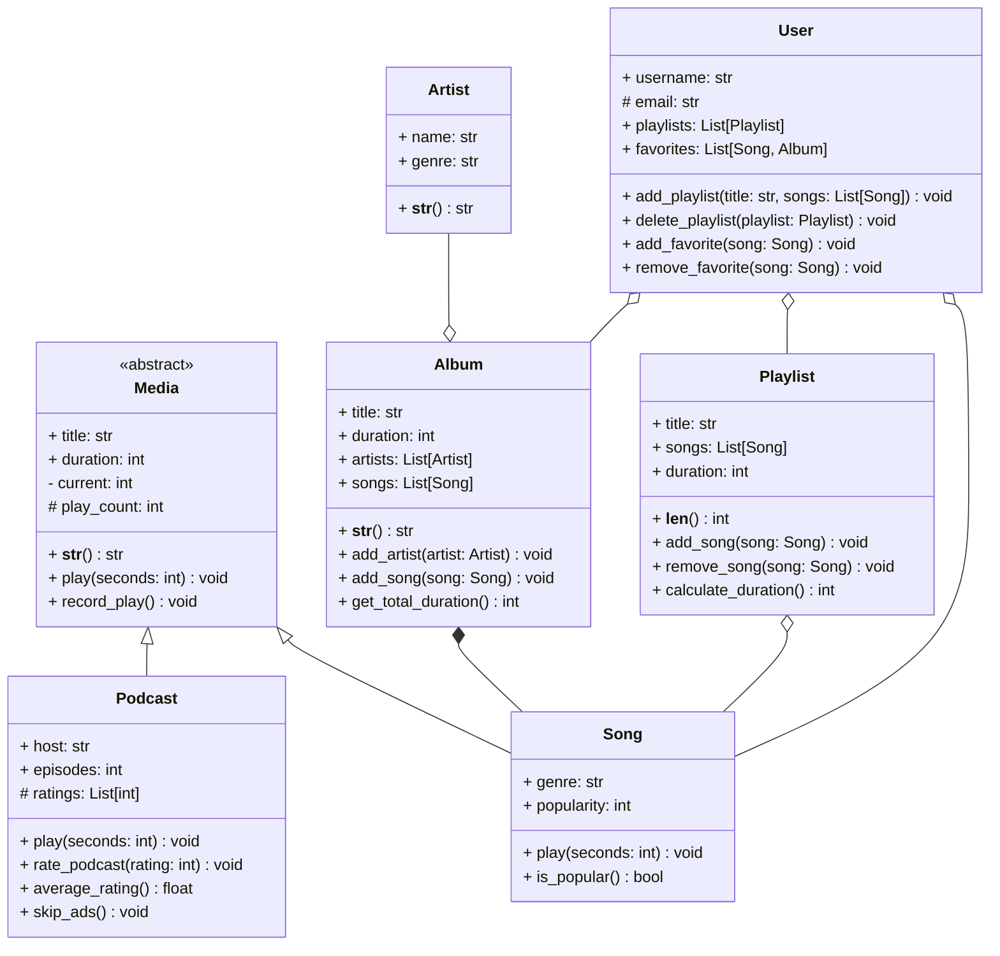

## Examen

**Durée de l'examen : 3h**

### :information_source: Consignes

L'objectif de ce TP est de mobiliser les notions abordées lors des TPs.

> #### :exclamation: Consignes
>
> L'accès à Internet est autorisé pour **consulter la documentation Python**. Il est **interdit de communiquer** avec d'autres personnes ou d'**utiliser des outils d'Intelligence Artificielle** tels que ChatGPT ou les auto-complétions de code. **En cas de triche, la note de 0 sera attribuée.**
>
{: .block-danger }

> #### :information_source: Barème
>
> Les conventions de nommage ainsi que toutes les règles de bonnes pratiques seront prises en compte dans la notation. Au moins une classe doit être complètement documentée.
>
{: .block-warning }
---

### :notes: Gestion d'un système de musique et de podcasts

Sophia O'Riordan, la responsable du département informatique du label de musique **EchoWave Records**, vous demande de créer une application de gestion de musique. Cette application doit pouvoir gérer les écoutes des chansons, des playlists ainsi que des podcasts.

#### :headphones: Media

<b><u>Attributs</u></b>
- `title` : le titre du média.
- `duration` : la durée du média en secondes.
- `current` : la position actuelle du média (nombre de secondes écoulées, par défaut 0).
- `play_count` : le nombre de fois que le média a été écouté.

<b><u>Méthodes</u></b>
- `__str__()` : une méthode spéciale abstraite qui affiche les informations d'une chanson.
- `play()` : une méthode abstraite permettant de jouer le média.
- `record_play()` : une méthode permettant de calculer le nombre de fois que le média a été écouté. À chaque fois que le média est écouté, cette méthode est appelée et incrémente le nombre de lectures.

---

#### :studio_microphone: Podcasts

<b><u>Attributs</u></b>
- `title` : le titre du podcast.
- `duration` : la durée du podcast en secondes.
- `current` : la position actuelle du podcast (nombre de secondes écoulées, par défaut 0).
- `play_count` : le nombre de fois que le podcast a été écouté.
- `host` : le nom de l'animateur.rice du podcast.
- `episodes` : le nombre d'épisodes du podcast.
- `ratings` : une liste des notes attribuées au podcast.

<b><u>Méthodes</u></b>
- `__str__()` : une méthode spéciale permettant d'afficher les informations du podcast au format suivant `Podcast title by host_name has number_episodes (duration seconds)` par exemple `Y'a plus de saisons by Swann Périssé has 12 episodes (92501 seconds)`.
- `play(seconds: int)` : une méthode permettant de lire le podcast
  - Si `seconds` est spécifié par l'utilisateur, ajouter `seconds` à `current`.
  - Sinon ajouter 10 minutes à la variable `current` (10 minutes = 600 secondes)
- `rate_podcast(rating: int)` : permet de noter (entre 1 et 5) le podcast.
  - Ajoute une note (`rating`) dans la liste de notes (`ratings`).
  - Si la note est inférieure à 1 ou supérieure à 5, une exception `InvalidRatingError` doit être levée.
- `average_rating()` : retourne la note moyenne du podcast, vous pouvez utiliser la méthode `mean` du module `statistics`.
- `skip_ads()` : ignore les publicités en avançant `current` de 10 secondes.

---

#### :microphone: Chansons

<b><u>Attributs</u></b>
- `title` : le titre de la chanson.
- `duration` : la durée de la chanson en secondes.
- `current` : la position actuelle de la chanson (nombre de secondes écoulées, par défaut 0).
- `play_count` : le nombre de fois que le média a été écouté.
- `genre` : le genre musical de la chanson.
- `popularity` : un entier représentant la popularité de la chanson (de 1 à 100).

<b><u>Méthodes</u></b>
- `__str__()` : une méthode spéciale permettant d'afficher les informations de la chanson au format `Song title has a popularity of popularity % (duration seconds)` par exemple `Paparazzi has a popularity of 90% (210 seconds)`.
- `play(seconds: int)` : une méthode permettant de jouer la chanson
  - Si `seconds` est spécifié par l'utilisateur, ajouter `seconds` à `current`.
  - Sinon ajouter 30 secondes à la variable `current`.
- `is_popular()` : une méthode permettant de vérifier si la chanson est populaire (booléen).
  - Une chanson est populaire si sa popularité est supérieure à 50.
  - Sinon, elle n'est pas considérée comme populaire.

---

#### :cd: Albums

<b><u>Attributs</u></b>
- `title` : le titre de l'album.
- `duration` : la durée totale de l'album en secondes.
- `artists` : la liste des artistes de l'album.
- `songs` : la liste des chansons de l'album.

<b><u>Méthodes</u></b>
- `__str__()` : une méthode spéciale permettant d'afficher les informations de l'album au format suivant `Album title by artist_name (duration seconds)` par exemple `Hit Me Hard And Soft by Billie Eilish (1803 seconds)`.
- `add_artist(artist: Artist)` : une méthode permettant d'ajouter un artiste à l'album.
- `add_song(song: Song)` : une méthode permettant d'ajouter une chanson à l'album.
- `get_total_duration()` : retourne la durée totale de l'album (en secondes).

---

#### :woman_singer: Artistes

<b><u>Attributs</u></b>
- `name` : le nom de l'artiste.
- `genre` : le genre musical de l'artiste.

<b><u>Méthodes</u></b>
- `__str__()` : une méthode spéciale permettant d'afficher les informations de l'artiste au format suivant `Artist name plays genre music` par exemple `Lady Gaga plays pop music`.

---

#### :musical_note: Playlists

<b><u>Attributs</u></b>
- `title` : le titre de la playlist.
- `songs` : la liste des chansons de la playlist.
- `duration` : la durée totale de la playlist en secondes.

<b><u>Méthodes</u></b>
- `__len__()` : une méthode spéciale permettant de récupérer le nombre de chansons dans la playlist.
- `add_song(song: Song)` : une méthode permettant d'ajouter une chanson à la playlist.
- `remove_song(song: Song)` : une méthode permettant de retirer une chanson de la playlist.
- `calculate_duration()` : une méthode permettant de calculer la durée totale de la playlist.

---

#### :bust_in_silhouette: Utilisateurs

<b><u>Attributs</u></b>
- `username` : le nom d'utilisateur.
- `email` : l'adresse email de l'utilisateur.
- `playlists` : la liste des playlists de l'utilisateur.
- `favorites` : la liste des chansons et albums favoris de l'utilisateur.

<b><u>Méthodes</u></b>
- `add_playlist(title: str, songs: list[Song])` : une méthode permettant d'ajouter une playlist à la liste des playlists de l'utilisateur.
- `delete_playlist(playlist: Playlist)` : une méthode permettant de supprimer une playlist.
- `add_favorite(song: Song)` : une méthode permettant d'ajouter une chanson aux favoris de l'utilisateur.
- `remove_favorite(song: Song)` : une méthode permettant de retirer une chanson des favoris de l'utilisateur.

---

#### :computer: Fonctionnalités

1. Créer la classe `Media`.
2. Créer la classe `Podcast`.
3. Créer la classe `Song`.
4. Créer la classe `Album`.
5. Créer la classe `Artist`.
6. Créer la classe `Playlist`.
7. Créer la classe `User`.
8. Créer un fichier principal `main.py` permettant d'interagir avec les différentes classes et de tester les différentes fonctionnalités.
   - Créer plusieurs artistes :
        1. Lady Gaga (genre : pop)
        2. Bruno Mars (genre : pop)
        3. Måneskin (genre : rock)
   - Créer des chansons pour chaque artiste.
        * `Die With A Smile`
          * Genre : pop
          * Durée : 180 secondes
          * Popularité : 80
        * `Paparazzi`
          * Genre : pop
          * Durée : 210 secondes
          * Popularité : 90
        * `Locked Out of Heaven`
          * Genre : pop
          * Durée : 190 secondes
          * Popularité : 85
        * `The Loneliest`
          * Genre : rock
          * Durée : 240 secondes
          * Popularité : 85
        * `Baby Said`
          * Genre : rock
          * Durée : 250 secondes
          * Popularité : 80
        * `Kool Kids`
          * Genre : rock
          * Durée : 220 secondes
          * Popularité : 45
   - Créer les albums suivants :
        * `Die With A Smile`
          * Artistes : Lady Gaga et Bruno Mars
          * Chansons : Die With A Smile
        * `The Fame`
            * Artistes : Lady Gaga
            * Chansons : Paparazzi
        * `Unorthodox Jukebox`
            * Artistes : Bruno Mars
            * Chansons : Locked Out of Heaven
        * `Rush`
          * Artistes : Måneskin
          * Chansons : The Loneliest, Baby Said, Kool Kids
   - Afficher le titre de l'album `Die With A Smile`.
   - Afficher la durée totale de l'album `Rush`.
   - Afficher si les chansons `Die With A Smile` et `Kool Kids` sont populaires.
   - Créer une playlist nommée `Pop Songs` et y ajouter les chansons de Lady Gaga et Bruno Mars.
   - Créer une playlist nommée `Rock Songs` et y ajouter les chansons de Måneskin.
   - Afficher la durée et le nombre de chansons de la playlist `Pop Songs`.
   - Créer un utilisateur avec les informations suivantes :
        - Nom d'utilisateur : `jane`
        - Email : `jane@email.com`
        - Playlists : `Pop Songs` et `Rock Songs`
        - Chansons en favori : `Die With A Smile` et `Baby Said`
        - Albums en favori : `The Fame` et `Rush`
   - Supprimer la playlist `Rock Songs` des favoris de Jane.
   - Ajouter la chanson `Paparazzi` aux favoris de Jane.
   - Créer un podcast nommé `Chez Sally` animé par Sally, durant au total 25 heures (25 heures = 90000 secondes) avec 35 épisodes et les notes suivantes : 5, 4, 3, 5, 4, 2, 5, 4, 5, 3, 4, 5, 4, 5, 1, 3.
   - Jouer le podcast `Chez Sally`
   - Noter le podcast avec une note de 4.
   - Afficher la note moyenne du podcast.
   - Écouter 30 secondes du podcast.
   - Ignorer la publicité.
   - Afficher les informations du podcast `Chez Sally`.

#### :hourglass: Bonne chance !

<!--
Héritage, polymorphisme, encapsulation, classes abstraites, interfaces, exceptions, gestion des erreurs, documentation
-->
