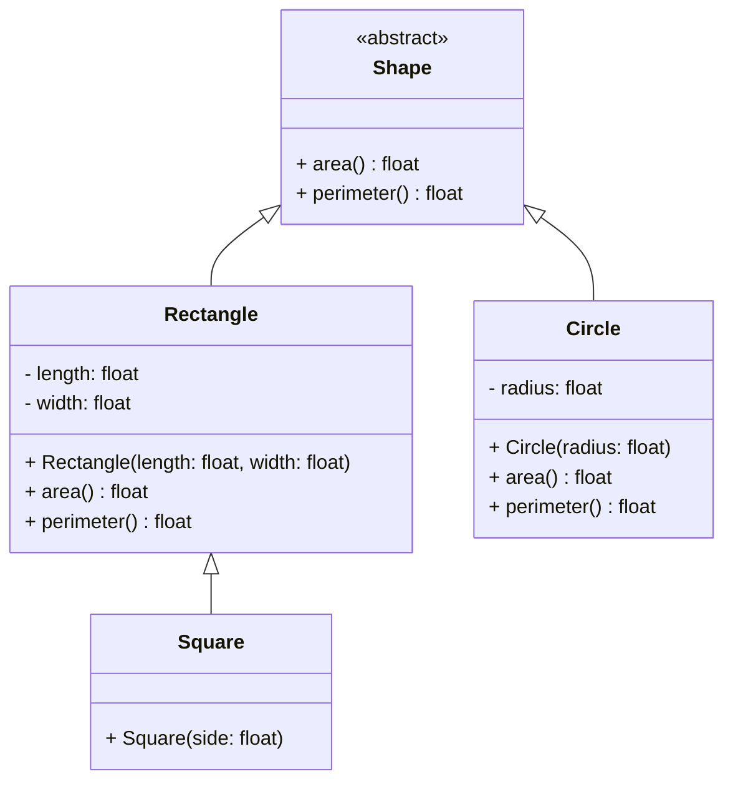

L'abstraction est un concept clé en programmation orientée objet qui permet de définir des classes abstraites pour définir des méthodes sans les implémenter. Les classes abstraites ne peuvent pas être instanciées directement, mais servent de modèle pour d'autres classes qui en héritent.

## Exercice : formes géométriques

Cet exercice vise à créer un programme en Python pour gérer différentes formes géométriques (formes de base comme un rectangle, un carré, etc.), en utilisant des classes, de l'héritage et le polymorphisme.

1. **Créer une classe `Shape` (forme de base)** :

   - Cette classe sera une classe abstraite pour les formes géométriques.
   - Elle doit contenir une méthode abstraite `area()` qui retourne l'aire de la forme.
   - Elle doit aussi contenir une méthode abstraite `perimeter()` qui retourne le périmètre de la forme.
       

2. **Créer une classe `Rectangle` (hérite de `Shape`)** :

   - Le rectangle est défini par une longueur (`length`) et une largeur (`width`).
   - Implémenter les méthodes `area()` et `perimeter()` pour cette classe :
     - L'aire d'un rectangle est `length * width`.
     - Le périmètre d'un rectangle est `2 * (length + width)`.
         

3. **Créer une classe `Square` (hérite de `Rectangle`)** :

   - Le carré est une forme spéciale de rectangle où `length` et `width` sont égaux.
   - Le constructeur de la classe `Square` doit prendre un seul paramètre `side` pour définir la longueur du côté.
   - Implémenter les méthodes `area()` et `perimeter()` en utilisant l'héritage de la classe `Rectangle`.
       

4. **Créer une classe `Circle` (hérite de `Shape`)** :

   - Le cercle est défini par un rayon (`radius`).
   - Implémenter les méthodes `area()` et `perimeter()` pour cette classe :
     - L'aire d'un cercle est calculée avec la formule $$\pi r^2$$ où $$r$$ est le rayon.
     - Le périmètre (ou la circonférence) d'un cercle est $$2\pi r$$ où $$r$$ est le rayon.
   - Importer le module [`math`](https://docs.python.org/3/library/math.html) pour obtenir la valeur de π (`math.pi`).
       

5. **Écrire un script pour tester vos classes** (fichier `main.py`) :
   - Créer une liste de formes qui contiendra des instances de `Rectangle`, `Square`, et `Circle`.
   - Parcourir cette liste et, pour chaque forme, affichez son type, son aire, et son périmètre.
