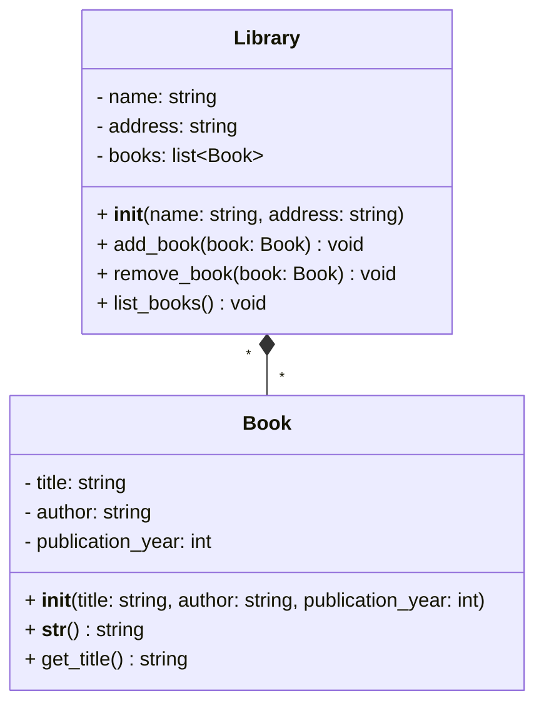
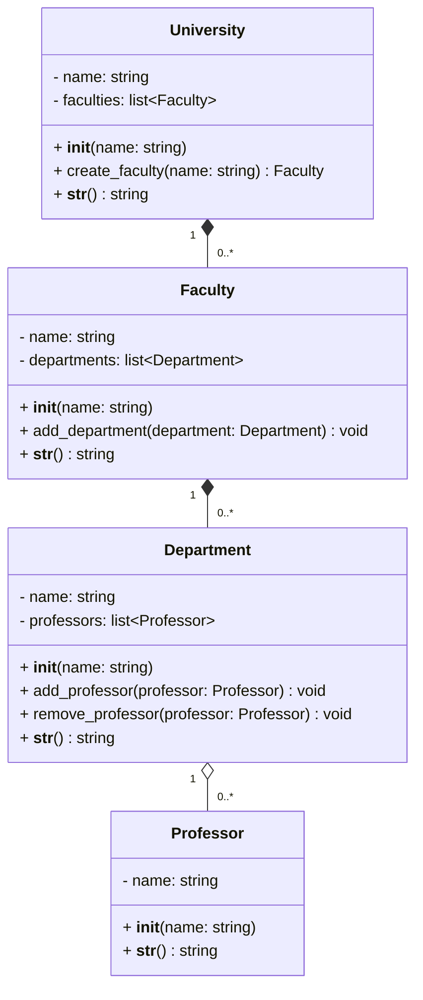
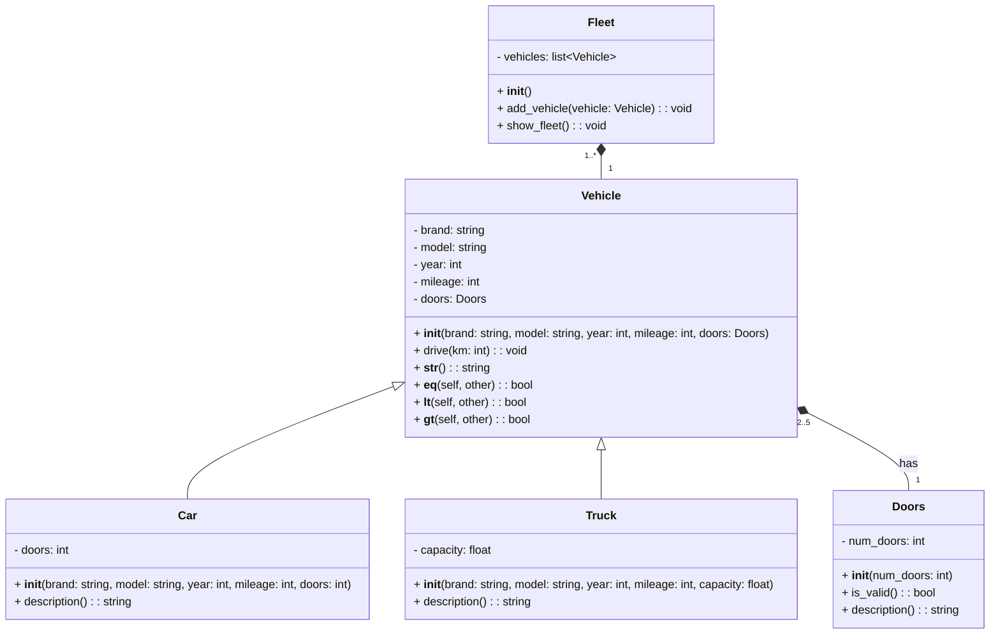

## Composition

La composition est un principe de la programmation orientée objet qui consiste à combiner des objets, des fonctions et des classes pour créer des systèmes plus complexes.
En utilisant la composition, on peut construire des objets en les reliant à d'autres objets, ce qui permet de créer des systèmes modulaires et réutilisables.
La composition est une alternative à l'héritage, qui permet de créer des objets en les combinant plutôt qu'en les étendant.

### Exercice 1 : système de gestion de bibliothèque

Cet exercice vise à créer un système de gestion de bibliothèque en Python en utilisant la composition pour combiner des objets et des classes.

:warning: **Attention** : Pour cet exercice, chaque classe doit être documentée avec des commentaires pour expliquer le rôle de la classe, les attributs et les méthodes.

1. **Créer une classe `Book`** (fichier `book.py`) :

   - Cette classe représente un livre avec des attributs tels que le titre, l'auteur et l'année de publication.
   - Elle doit contenir une méthode `__str__()` qui affiche les informations du livre.
   - Elle doit contenir une méthode `get_title()` qui retourne le titre du livre.
       

2. **Créer une classe `Library`** (fichier `library.py`) :

   - Cette classe représente une bibliothèque qui contient une collection de livres.
   - Une bibliothèque est identifiée par un nom et une adresse.
   - Elle doit contenir une méthode `add_book(book: Book)` qui ajoute un livre à la bibliothèque.
   - Elle doit contenir une méthode `remove_book(book: Book)` qui supprime un livre de la bibliothèque.
   - Elle doit contenir une méthode `list_books()` qui affiche la liste des livres de la bibliothèque.
       

3. **Créer un programme principal** (fichier `main.py`) :

   - Créer les livres suivants :
     - "Normal People" de Sally Rooney, paru en 2018
     - "The Great Gatsby" de F. Scott Fitzgerald, paru en 1925
     - "1984" de George Orwell, paru en 1949
     - "Pride and Prejudice" de Jane Austen, paru en 1813
   - Créer la bibliothèque "Bibliothèque Colette Vivier" à l'adresse "6 Rue Fourneyron, 75017 Paris".
   - Ajouter les livres dans la bibliothèque.
   - Afficher la liste des livres de la bibliothèque.
   - Supprimer le livre "1984" de la bibliothèque.
   - Afficher à nouveau la liste des livres de la bibliothèque.
   - Afficher les informations du livre "Pride and Prejudice".
   - Afficher le titre du live "Normal People".

---

## Exercice 2 : Gestion d'une université

Cet exercice modélise une université et sa structure interne à travers des relations de composition et d'agrégation. Vous allez gérer la création d'une université, l'ajout de facultés, de départements, et de professeurs, tout en observant les impacts des relations sur la destruction des objets.

:warning: **Attention** : Chaque classe doit être bien documentée avec des commentaires pour expliquer les attributs et les méthodes.

1. Classe `Professor` : représente un professeur

   - **Méthode** :
     - `__str__()` : Retourne une chaîne décrivant le professeur.

2. Classe `Department` : représente un département regroupant des professeurs

   - **Méthodes** :
     - `add_professor(professor: Professor)` : Ajouter un professeur au département (maximum 5 par département).
     - `remove_professor(professor: Professor)` : Retire un professeur du département.
     - `__str__()` : Retourne une description complète du département et ses professeurs.

3. Classe `Faculty` : représente une faculté composée de départements

   - **Méthodes** :
     - `add_department(department: Department)` : Ajoute un département à la faculté.
     - `__str__()` : Retourne une description complète de la faculté et ses départements.

4. Classe `University` : représente une université composée de facultés

   - **Méthodes** :
     - `create_faculty(name: str)` : Crée et ajoute une faculté à l'université.
     - `__str__()` : Retourne une description complète de l'université et ses facultés.

5. Programme principal (fichier `main.py`) :
   - Créez une université nommée **Université Paris Cité**.
   - Ajoutez deux facultés : **Faculté des Lettres** et **Faculté des Sciences**.
   - Associez les départements suivants à chaque faculté :
     - **Faculté des Lettres** :
       - Littérature
       - Philosophie
     - **Faculté des Sciences** :
       - Physique
       - Biologie
       - Informatique
       - Mathématiques
   - Créez des professeurs : Ada Lovelace, Hannah Arendt, Louis Pasteur, Marie Curie, Rosalind Franklin, Simone de Beauvoir, Sophie Germain, Virginia Woolf
   - Répartissez les professeurs dans les départements :
     - Département **Littérature** : Virginia Woolf
     - Département **Philosophie** : Hannah Arendt, Simone de Beauvoir
     - Département **Physique** : Marie Curie, Louis Pasteur
     - Département **Biologie** : Rosalind Franklin
     - Département **Informatique** : Ada Lovelace
     - Département **Mathématiques** : Sophie Germain
   - Affichez les informations détaillées de l'université :
     - Nom de l'université.
     - Facultés avec leurs départements.
     - Départements avec la liste des professeurs affiliés.
   - Supprimez l'université et vérifiez :
     - Les facultés et départements associés sont également supprimés.
     - Les professeurs restent intacts après la suppression.
   - Affichez à nouveau la liste des professeurs pour confirmer leur existence.

---

## Exercice 3 : simulation d'une flotte de véhicules

Cet exercice vise à modéliser une flotte de véhicules en Python en utilisant l'héritage et le polymorphisme pour gérer différents types de véhicules.

:warning: **Attention** : Chaque classe doit être bien documentée avec des commentaires pour expliquer les attributs et les méthodes.

1. **Créer une classe `Vehicle`** (fichier `vehicle.py`) :

   - Cette classe représente un véhicule générique avec des attributs pour la marque, le modèle, l'année et le kilométrage.
   - Elle doit contenir une méthode `drive(km: int)` qui ajoute les kilomètres au kilométrage existant.
   - Elle doit contenir une méthode spéciale `__str__()` qui affiche les informations du véhicule.
       

2. **Créer deux sous-classes de `Vehicle`** (fichiers `car.py` et `truck.py`) :

   - **`Car`** :
     - Ajoute un attribut `doors` pour le nombre de portes.
     - Contient une méthode `description()` qui retourne une description spécifique.
   - **`Truck`** :
     - Ajoute un attribut `capacity` pour la capacité en tonnes.
     - Contient une méthode `description()` qui retourne une description spécifique.
         

3. **Créer une classe `Fleet`** (fichier `fleet.py`) :

   - Cette classe représente une flotte contenant une collection de véhicules.
   - Elle doit contenir une méthode `add_vehicle(vehicle: Vehicle)` pour ajouter un véhicule à la flotte.
   - Elle doit contenir une méthode `show_fleet()` pour afficher les informations de tous les véhicules.
       

4. **Créer une classe `Doors`** (fichier `doors.py`) :

   - Cette classe représente le nombre de portes d'un véhicule.
   - Attributs :
     - `num_doors` : un entier représentant le nombre de portes du véhicule, qui doit être compris entre 2 et 5.
   - Méthodes :
     - `is_valid()` : vérifie si le nombre de portes est valide (entre 2 et 5).
     - `description()` : retourne une description du nombre de portes du véhicule.
         

5. **Modifier la classe `Vehicle` pour inclure des portes** :

   - Ajoutez un attribut `doors` qui est une instance de la classe `Doors`.
   - Adaptez la méthode `__str__()` pour inclure les informations sur les portes en appelant `doors.description()`.
       

6. **Implémenter les méthodes spéciales pour comparer des véhicules** :

   - Ajoutez les méthodes suivantes dans la classe `Vehicle` :
     - `__eq__(self, other)` : permet de comparer l'égalité des véhicules en fonction du kilométrage.
     - `__lt__(self, other)` : permet de comparer si un véhicule a moins de kilométrage qu'un autre.
     - `__gt__(self, other)` : permet de comparer si un véhicule a plus de kilométrage qu'un autre.

7. **Créer un programme principal `main.py`** :

   - Créer les véhicules suivants :
     - Voiture 1 : Toyota, Corolla, 2018, 50000 km, 4 portes.
     - Voiture 2 : Honda, Civic, 2015, 80000 km, 2 portes.
     - Camion : Volvo, FH16, 2015, 120000 km, 25 tonnes.
   - Ajouter ces véhicules à une flotte.
   - Afficher les informations de tous les véhicules de la flotte.
   - Comparer les deux voitures en fonction de leur kilométrage (utiliser les méthodes `==`, `<`, `>`).
   - Simuler la conduite d'un véhicule en ajoutant des kilomètres au kilométrage de la voiture 1.
   - Afficher à nouveau les informations du véhicule après la conduite.

---

## Ressources

- [PEP 8](https://peps.python.org/pep-0008/)
- [NumpyDoc](https://numpydoc.readthedocs.io/en/latest/format.html)
