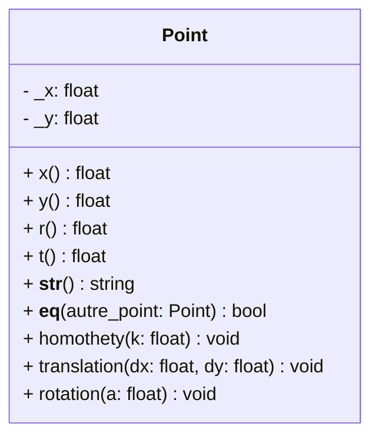

# Méthodes spéciales

Les `méthodes spéciales`, aussi appelées méthodes magiques ou méthodes du double underscore (dunder), sont des méthodes prédéfinies en Python qui permettent de surcharger le comportement des opérateurs et des fonctions intégrées. Ces méthodes sont appelées automatiquement par l'interpréteur Python en fonction de l'opération effectuée.

## Exercice : points du plan

Définissez une classe `Point` pour représenter les points du plan rapporté à une origine fixée.
Les coordonnées d’un point sont ici deux nombres flottants `x`, `y`, mémorisés dans deux attributs **privés**.

La classe `Point` comportera au moins les méthodes suivantes :

- `__init__(self, x, y)` : constructeur d’un point à partir de ses coordonnées cartésiennes.
- `x(self), y(self)` : retourne les coordonnées cartésiennes du point.
- `r(self), t(self)` : retourne les coordonnées polaires du point (voir ci-dessous).
- `__str__(self)` : renvoie les coordonnées du point sous format texte. Si on crée un point d'abscisse 2 et d'ordonnée 3, la fonction retournera $$(2.0, 3.0)$$.
- `__eq__(self, autre_point)` : comparaison répondant à la question « les deux points représentent-ils deux points identiques ? ».
- `homothety(self, k)` : appliquer au point une homothétie de centre $$(0, 0)$$ et de rapport $$k$$ (k est un flottant). Pour cela, on multiplie les coordonnées $$(x, y)$$ par $$k$$ pour obtenir $$(kx, ky)$$.
- `translation(self, dx, dy)` : appliquer au point une translation de vecteur $$(dx, dy)$$. Cela consiste à remplacer $$(x, y)$$ par $$(x + dx, y + dy)$$.
- `rotation(self, a)` : appliquant au point une rotation de centre $$(0, 0)$$ et d’angle $$a$$. Une manière – qui n’est pas la plus efficace – de faire cela consiste à calculer les coordonnées polaires $$(r, t)$$ correspondant à $$(x, y)$$ puis les coordonnées cartésiennes $$(x′, y′)$$ correspondant à $$(r, t + a)$$.

#### Rappel des formules

- Coordonnées cartésiennes à partir des coordonnées polaires : $$x = r cos(t)$$ et $$y = r sin(t)$$
- Coordonnées polaires à partir des coordonnées cartésiennes : $$r = \sqrt{x^2 + y^2}$$ et $$t = atan2(y, x)$$
