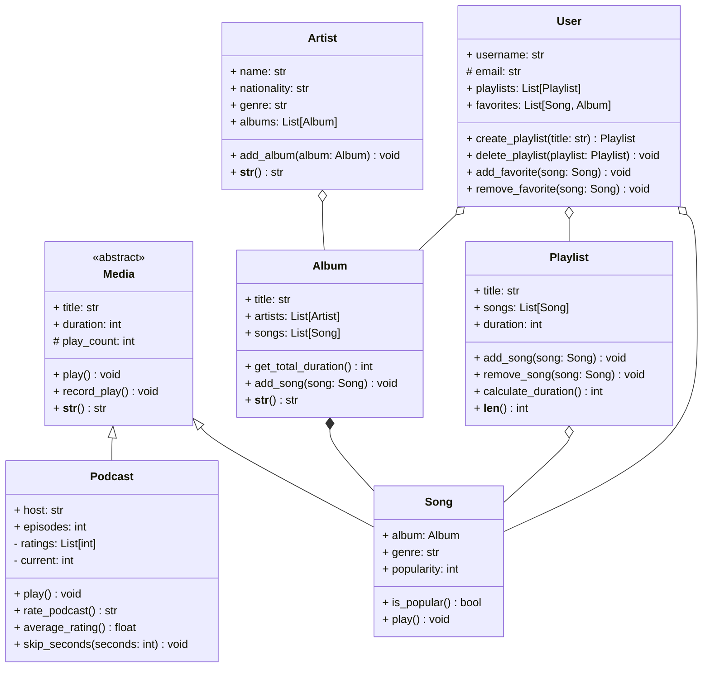

## Examen

### :information_source: Consignes

**Durée de l'examen : 3h**

L'objectif de ce TP est de mobiliser les notions abordées lors des TPs.

L'accès à Internet est autorisé pour consulter la documentation Python, mais il est interdit de communiquer avec d'autres personnes ou d'utiliser des outils d'IA ou des chatbots tels que ChatGPT. En cas de triche, la note de 0 sera attribuée.

:warning: Les conventions de nommage ainsi que toutes les règles de bonnes pratiques seront prises en compte dans la notation.

---

### :notes: Gestion d'un système de musique, podcasts et livres audios

Sophia O'Riordan, la responsable du département informatique du label de musique **EchoWave Records**, vous demande de créer une application de gestion de musique. Cette application doit pouvoir gérer les écoutes des chansons, des playlists ainsi que des podcasts et des livres audios.

#### :headphones: Media

<u>Attributs</u>
- `title` : le titre du média.
- `duration` : la durée du média en secondes.
- `play_count` : le nombre de fois que le média a été écouté.

<u>Méthodes</u>
- `record_play()` : une méthode permettant de calculer le nombre de fois que le média a été écouté. À chaque fois que le média est écouté, cette méthode doit être appelée et incrémente le nombre de lectures.
- `play()` : une méthode abstraite permettant de jouer le média.
- `__str__()` : une méthode spéciale permettant d'afficher les informations du média au format suivant `Title played xx times (duration seconds)` par exemple `Stairway to Heaven played 10 times (482 seconds)`.

---

#### :studio_microphone: Podcasts

<u>Attributs</u>
- `title` : le titre du podcast.
- `duration` : la durée du podcast en secondes.
- `current` : la position actuelle du podcast (nombre de secondes écoulées, par défaut 0).
- `play_count` : le nombre de fois que le podcast a été écouté.
- `host` : le nom de l'animateur du podcast.
- `episodes` : le nombre d'épisodes du podcast.
- `ratings` : une liste des notes attribuées au podcast.

<u>Méthodes</u>
- `play()` : une méthode permettant de jouer le podcast.
- `rate_podcast()` : une méthode permettant de noter le podcast. Une note est un entier entre 1 et 5. Si la note est inférieure à 1 ou supérieure à 5, une exception `InvalidRatingError` doit être levée.
- `average_rating()` : retourne la note moyenne du podcast.
- `skip_seconds(seconds: int)` : une méthode permettant de sauter un certain nombre de secondes dans le podcast (i.e. avancer la position actuelle `current` de `seconds` secondes).

---

#### :microphone: Chansons

<u>Attributs</u>
- `title` : le titre de la chanson.
- `duration` : la durée de la chanson en secondes.
- `play_count` : le nombre de fois que le média a été écouté.
- `album` : le nom de l'album de la chanson.
- `genre` : le genre musical de la chanson.
- `popularity` : un entier représentant la popularité de la chanson (de 1 à 100).

<u>Méthodes</u>
- `is_popular()` : une méthode permettant de vérifier si la chanson est populaire (si la popularité est supérieure à 50).
- `play()` : une méthode permettant de jouer la chanson (affiche `Playing song: song_title of artist_name` par exemple `Playing song: Stairway to Heaven of Led Zeppelin`) et incrémente le nombre de lectures.

---

#### :cd: Albums

<u>Attributs</u>
- `title` : le titre de l'album.
- `artists` : la liste des artistes de l'album.
- `songs` : la liste des chansons de l'album.

<u>Méthodes</u>
- `get_total_duration()` : une méthode permettant de calculer la durée totale de l'album (en secondes).
- `add_song(song: Song)` : une méthode permettant d'ajouter une chanson à l'album.
- `__str__()` : une méthode spéciale permettant d'afficher les informations de l'album au format suivant `Album title by artist_name (duration seconds)` par exemple `Led Zeppelin IV by Led Zeppelin (2542 seconds)`.

---

#### :woman_singer: Artistes

<u>Attributs</u>
- `name` : le nom de l'artiste.
- `nationality` : la nationalité de l'artiste.
- `genre` : le genre musical de l'artiste.
- `albums` : la liste des albums de l'artiste.
- `songs` : la liste des chansons de l'artiste.

<u>Méthodes</u>
- `add_album(album: Album)` : une méthode permettant d'ajouter un album à la liste des albums de l'artiste.
- `__str__()` : une méthode spéciale permettant d'afficher les informations de l'artiste au format suivant `Artist name has albums_count albums and songs_count songs` par exemple `Led Zeppelin has 9 albums and 87 songs`.

---

#### :musical_note: Playlists

<u>Attributs</u>
- `title` : le titre de la playlist.
- `songs` : la liste des chansons de la playlist.
- `duration` : la durée totale de la playlist en secondes.

<u>Méthodes</u>
- `add_song(song: Song)` : une méthode permettant d'ajouter une chanson à la playlist.
- `remove_song(song: Song)` : une méthode permettant de retirer une chanson de la playlist.
- `calculate_duration()` : une méthode permettant de calculer la durée totale de la playlist.
- `__len__()` : une méthode spéciale permettant de récupérer le nombre de chansons dans la playlist.

---

#### :bust_in_silhouette: Utilisateurs

<u>Attributs</u>
- `username` : le nom d'utilisateur.
- `email` : l'adresse email de l'utilisateur.
- `playlists` : la liste des playlists de l'utilisateur.
- `favorites` : la liste des chansons et albums favoris de l'utilisateur.

<u>Méthodes</u>
- `create_playlist(title: str)` : une méthode permettant de créer une playlist avec un titre donné.
- `delete_playlist(playlist: Playlist)` : une méthode permettant de supprimer une playlist.
- `add_favorite(song: Song)` : une méthode permettant d'ajouter une chanson aux favoris de l'utilisateur.
- `remove_favorite(song: Song)` : une méthode permettant de retirer une chanson des favoris de l'utilisateur.

---

#### :computer: Fonctionnalités

1. Créer la classe `Media`.
2. Créer la classe `Podcast`.
3. Créer la classe `Song`.
4. Créer la classe `Album`.
5. Créer la classe `Artist`.
6. Créer la classe `Playlist`.
7. Créer la classe `User`.
8. Créer un fichier principal `main.py` permettant d'interagir avec les différentes classes et de tester les différentes fonctionnalités.
   - Créer plusieurs artistes :
        1. Lady Gaga
        2. Bruno Mars
        3. Taylor Swift
        4. Måneskin
        5. Nirvana
   - Créer un ou deux albums pour chaque artiste.
        * `Die with a smile` de Lady Gaga et Bruno Mars
        * `The Fame` de Lady Gaga
        * `Unorthodox` Jukebox de Bruno Mars
        * `Midnights` de Taylor Swift
        * `Teatro d'ira: Vol. I` de Måneskin
        * `Rush` de Måneskin
        * `Nevermind` de Nirvana
   - Ajouter des chansons à chaque album.
        * `Die with a smile` dans l'album éponyme (genre : pop, durée : 180 secondes, popularité : 80)
        * `Paparazzi` dans l'album `The Fame` (genre : pop, durée : 210 secondes, popularité : 90)
        * `Locked Out of Heaven` dans l'album `Unorthodox Jukebox` (genre : pop, durée : 190 secondes, popularité : 85)
        * `Anti-hero` dans l'album `Midnights` (genre : pop, durée : 200 secondes, popularité : 75)
        * `Zitti E Buoni` dans l'album `Teatro d'ira: Vol. I` (genre : rock, durée : 220 secondes, popularité : 95)
        * `I Wanna Be Your Slave` dans l'album Teatro d'ira: Vol. I` (genre : rock, durée : 230 secondes, popularité : 90)
        * `The Loneliest` dans l'album `Rush` (genre : rock, durée : 240 secondes, popularité : 85)
        * `Baby Said` dans l'album `Rush` (genre : rock, durée : 250 secondes, popularité : 80)
        * `Smells Like Teen Spirit` dans l'album `Nevermind` (genre : rock, durée : 260 secondes, popularité : 63)
        * `Come as You Are` dans l'album `Nevermind` (genre : rock, durée : 270 secondes, popularité : 95)
        * `Lithium` dans l'album `Nevermind` (genre : rock, durée : 280 secondes, popularité : 32)
   - Afficher la durée totale de l'album `Teatro d'ira: Vol. I` de Måneskin.
   - Afficher si les chansons `Die with a smile` et `Lithium` sont populaires.
   - Créer une playlist nommée `Pop Songs` et y ajouter les chansons de Lady Gaga, Bruno Mars et Taylor Swift.
   - Créer une playlist nommée `Rock Songs` et y ajouter les chansons de Måneskin et Nirvana.
   - Créer un utilisateur avec les informations suivantes :
        - Nom d'utilisateur : `jane`
        - Email : `jane@email.com`
        - Ajouter les playlists `Pop Songs` et `Rock Songs` aux playlists de Jane.
        - Ajouter les chansons `Die with a smile` et `Smells Like Teen Spirit` aux favoris de Jane.
        - Supprimer la playlist `Rock Songs` de Jane.
        - Ajouter la chanson `Zitti E Buoni` de Måneskin aux favoris de Jane.
   - Créer un podcast nommé `Chez Sally` animé par Sally avec 35 épisodes et les notes suivantes : 5, 4, 3, 5, 4, 2, 5, 4, 5, 3, 4, 5, 4, 5, 1, 3.
   - Jouer le podcast `Chez Sally` et noter le podcast avec une note de 4.
   - Afficher la note moyenne du podcast `Chez Sally`.
   - Sautez 30 secondes dans le podcast `Chez Sally`.
   - Afficher les informations du podcast `Chez Sally`.

#### :hourglass: Bonne chance !

<!--
Héritage, polymorphisme, encapsulation, classes abstraites, interfaces, exceptions, gestion des erreurs, documentation
-->
