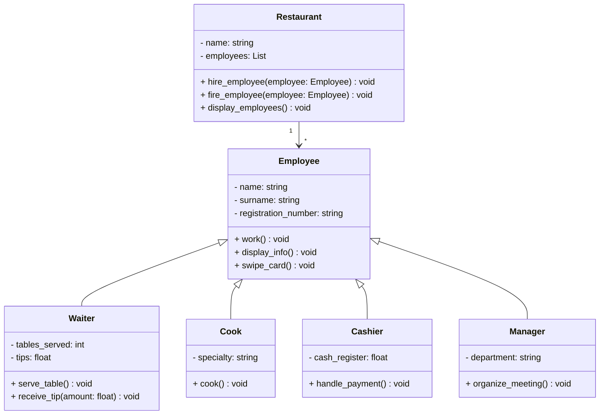

L'héritage est un mécanisme qui permet de créer une classe enfant qui hérite des attributs et des méthodes de la classe parent.

> #### ATTENTION
>
> Bien respecter les conventions de nommage des classes et des fichiers en Python.
> Les noms de classes doivent commencer par une majuscule et utiliser la notation CamelCase.
> Les noms de fichiers doivent être en minuscules et séparés par des underscores.
>
>  
> **Exemples**
>
> Animal
>
> - nom du fichier : `animal.py`
> - nom de la classe : `class Animal`
>
> Poisson rouge
>
> - nom du fichier : `poisson_rouge.py`
> - nom de la classe : `class PoissonRouge`
>   {: .block-warning }

## Exercice : gestion des employés d'un restaurant

Pauses Café est une chaîne de cafés qui souhaite gérer les employés de ses différents établissements.
Pour cela, Paula DUPOINT, la responsable des ressources humaines, vous demande de créer une application qui permettra de gérer les employés de la chaîne.

Dans les restaurants, il y a des serveurs, des cuisiniers, des caissiers, des managers. Chaque employé a des attributs et des comportements spécifiques.

**Question 1.** Créer une classe `Employee` (fichier `employee.py`) qui définit les attributs suivants :

- `name` : le prénom de l'employé
- `surname` : le nom de famille de l'employé
- `registration_number` : le matricule de l'employé

**Question 2.** Ajouter les méthodes suivantes à la classe `Employee` :

- `work()` : affiche un message indiquant que l'employé est en train de travailler
- `display_info()` : affiche les informations de l'employé (nom, prénom, matricule)
- `swipe_card()` : affiche un message indiquant que l'employé a badgé

**Question 3.** Créer la classe `Waiter` (fichier `waiter.py`) qui hérite de la classe `Employee` et ajoute un attribut `tables_served` et une méthode `serve_table()` qui affiche un message indiquant que le serveur est en train de servir une table. Un serveur peut également recevoir des pourboires, créer une méthode `receive_tips()` qui affiche un message indiquant que le serveur a reçu un pourboire et calcule le montant total des pourboires reçus.

**Question 4.** Créer la classe `Cook` (fichier `cook.py`) qui hérite de la classe `Employee` et ajoute un attribut `specialty` et une méthode `cook()` qui affiche un message indiquant que le cuisinier est en train de cuisiner.

**Question 5.** Créer la classe `Cashier` (fichier `cashier.py`) qui hérite de la classe `Employee` et ajoute un attribut `cash_register` et une méthode `handle_payment()` qui affiche un message indiquant que le caissier est en train de gérer un paiement.

**Question 6.** Créer la classe `Manager` (fichier `manager.py`) qui hérite de la classe `Employee` et ajoute un attribut `department` et une méthode `organize_meeting()` qui affiche un message indiquant que le manager est en train d'organiser une réunion.

**Question 7.** Créer la classe `Restaurant` (fichier `restaurant.py`) qui permet de gérer les employés du restaurant.

- Un restaurant possède un nom et une liste d'employés.
- Ajouter une méthode `hire_employee()` qui permet d'embaucher un employé.
- Ajouter une méthode `fire_employee()` qui permet de licencier un employé.
- Ajouter une méthode `display_employees()` qui permet d'afficher la liste des employés du restaurant.

**Question 8.** Créer un programme principal (fichier `main.py`) qui permet de tester les différentes classes et méthodes.

- Créer plusieurs employés de différents types (serveurs, cuisiniers, caissiers, managers).
- Créer un restaurant.
- Ajouter les employés au restaurant.
- Afficher les informations des employés du restaurant.
- Tester les méthodes spécifiques à chaque type d'employé.
- Licencier un employé.
