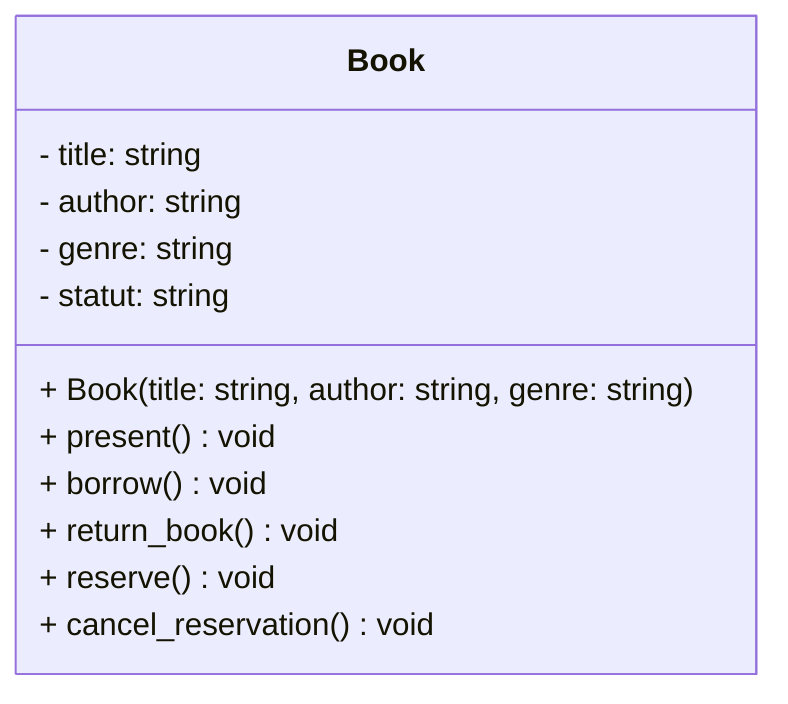

<!--
La programmation orientée objet (POO) est un paradigme de programmation qui repose sur le concept d'objets et de classes. Grâce à ce principe fondamental, la conception de code et la construction de logiciels deviennent beaucoup plus faciles. La programmation orientée objet facilite la création de logiciels modulaires, réutilisables et faciles à entretenir.

Voici un example de classe en Python, on y retrouve un constructeur `__init__` et des méthodes `start`, `drive` et `display_info`.

```python
class Car:
    def __init__(self, make, model, year):
        self.make = make
        self.model = model
        self.year = year
        self.mileage = 0

    def start(self):
        """Start the car."""
        print(f"{self.make} {self.model} is starting!")

    def drive(self, distance):
        """Drive the car for a given distance."""
        self.mileage += distance
        print(f"{self.make} {self.model} is driving for {distance} km.")

    def display_info(self):
        """Display information about the car."""
        print(f"Car: {self.make} {self.model}, Year: {self.year}, Mileage: {self.mileage} km")


# Using the Car class
toyota = Car("Toyota", "Corolla", 2020)
toyota.display_info()
toyota.start()
toyota.drive(150)
toyota.display_info()

```
Ci-dessous le résultat de l'exécution du code:
```bash
Car: Toyota Corolla, Year: 2020, Mileage: 0 km
Toyota Corolla is starting!
Toyota Corolla is driving for 150 km.
Car: Toyota Corolla, Year: 2020, Mileage: 150 km
```
-->

## Gestion d'une bibliothèque

L'objectif de ce TP est de gérer une bibliothèque de livres. Pour cela, nous allons créer une classe `Book` qui permettra de gérer les livres de la bibliothèque.

Implémenter une classe `Book` présentant les caractéristiques suivantes :

- `title` : le titre du livre
- `author` : l'auteur du livre
- `genre` : le genre littéraire du livre



Un livre doit présenter les comportements suivants :

- **Constructeur** :

  - Prend en paramètre `title`, `author` et `genre`.
  - Initialise le livre avec un statut disponible : création des attributs `_is_borrowed` et `_is_reserved` (booléens définis par défaut à `False`).

- **Présentation du livre** :

  - Affiche un message indiquant le titre, l'auteur et le genre du livre.

- **Emprunter le livre** :

  - Si le livre est disponible, changer le statut d'emprunt et afficher un message indiquant que le livre a été emprunté.
  - Si le livre est déjà emprunté, afficher un message indiquant "The book is already borrowed.".

- **Retourner le livre** :

  - Si le livre est emprunté, changer le statut de réservation et afficher un message indiquant que le livre a été retourné.
  - Si le livre est déjà disponible, afficher un message indiquant "The book is available.".

- **Réserver le livre** :
  - Si le livre est disponible, changer le statut de réservation et afficher un message indiquant que le livre a été réservé.
  - Si le livre est emprunté ou déjà réservé, afficher un message indiquant "The book {self.title} is already reserved.".

**NB** : Pour créer un livre, il faut indiquer son titre, son auteur et son genre.

Voici un exemple d'utilisation de la classe `Book` :

```python
normal_people = Book(
    title="Normal people",
    author="Sally Rooney",
    genre="Novel",
)
normal_people.present()
normal_people.borrow()
normal_people.borrow()
normal_people.return_book()
normal_people.reserve()
normal_people.cancel_reservation()

```

dont le résultat attendu est le suivant :

```bash
Book:
  - Title : Normal people
  - Author : Sally Rooney
  - Genre : Novel
The book Normal people has been borrowed successfully.
The book Normal people is already borrowed.
The book Normal people has been returned successfully.
The book Normal people has been reserved successfully.
The reservation has been canceled successfully.
```

### TO-DO

1. Créer la classe `Book` ainsi que son constructeur. Attention à la visibilité des attributs.
2. Implémenter la méthode `present` pour afficher les informations du livre.
3. Implémenter la méthode `borrow` pour gérer l'emprunt du livre.
4. Implémenter la méthode `return` pour gérer le retour du livre.
5. Implémenter la méthode `reserve` pour gérer la réservation du livre.
6. Implémenter la méthode `cancel_reservation` pour annuler la réservation du livre.

<!--

## Suivi des achats de produits par des clients

L’objectif du programme est de permettre le suivi des achats de produits par des clients.

### Informations sur le client

Le système doit tracer les informations suivantes d’un client :

- Nom
- Prénom
- Tous les achats d’un client

Il est nécessaire de pouvoir créer un client, en indiquant son nom et son prénom. Le système doit également permettre d’ajouter un achat pour un client.

### Informations sur le produit

Un produit possède les informations suivantes :

- Son identifiant
- Son libellé
- Son prix unitaire

Le système doit permettre de créer un produit en renseignant les trois informations ci-dessus.

**NB :** il n’est pas nécessaire de gérer les doublons.

Le système doit également pouvoir afficher un descriptif du produit au format : [Identifiant] – [Libellé] – PU : [Prix unitaire]

### Informations sur un achat

Les informations relatives à un achat sont les suivantes :

- Un produit
- Une quantité achetée

Le système doit permettre de calculer le **Prix total** d’un achat selon la formule suivante : Prix Unitaire x Quantité

### Liste des achats d’un client

Enfin, il faut pouvoir lister tous les achats d’un client sous le format suivant (1 ligne par achat) :

Achats de [Nom] [Prénom]

Produit : [Descriptif produit] | Quantité : [quantité] | Prix Total : [quantité x prix unitaire]
-->
