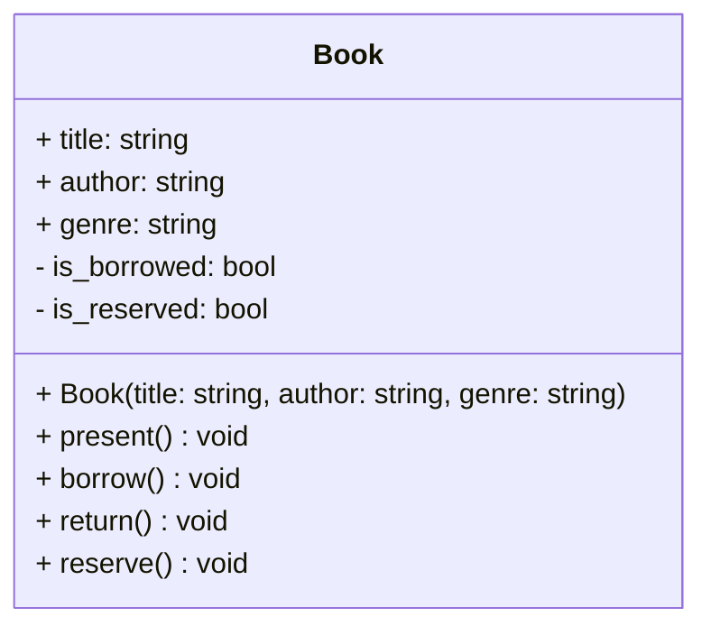
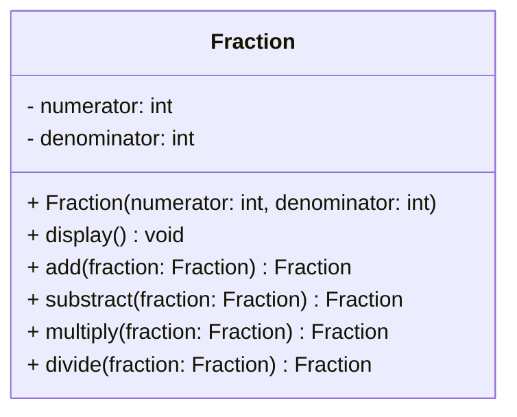

## Introduction à la Programmation Orientée Objet

### Exercice 1 : Gestion d'une bibliothèque

L'objectif de ce TP est de gérer une bibliothèque de livres. Pour cela, nous allons créer une classe `Book` qui permettra de gérer les livres de la bibliothèque.

Implémenter une classe `Book` présentant les caractéristiques suivantes :

- `title` : le titre du livre
- `author` : l'auteur du livre
- `genre` : le genre littéraire du livre



Un livre doit présenter les comportements suivants :

- **Constructeur** :

  - Créer une fonction `__init__` qui prend en paramètre `title`, `author` et `genre`.
  - Initialise le livre avec un statut disponible : création des attributs `_is_borrowed` et `_is_reserved` (booléens définis par défaut à `False`).
    <br/><br/>

- **Présentation du livre** :

  - Créer une fonction `present` qui affiche un message indiquant le titre, l'auteur et le genre du livre.
    <br/><br/>

- **Emprunter le livre** :

  - Créer une fonction `borrow` qui permet d'emprunter un livre.
  - Si le livre est disponible, changer le statut d'emprunt et afficher un message indiquant que le livre a été emprunté.
  - Si le livre est déjà emprunté, afficher un message indiquant "The book is already borrowed.".
    <br/><br/>

- **Retourner le livre** :

  - Créer une fonction `return` qui permet de retourner un livre.
  - Si le livre est emprunté, changer le statut d'emprunt et afficher un message indiquant que le livre a été retourné.
  - Si le livre est déjà disponible, afficher un message indiquant "The book is available.".
    <br/><br/>

- **Réserver le livre** :

  - Créer une fonction `reserve` qui permet de réserver un livre.
  - Si le livre est disponible, changer le statut de réservation et afficher un message indiquant que le livre a été réservé.
  - Si le livre est emprunté ou déjà réservé, afficher un message indiquant "The book {self.title} is already reserved.".
    <br/><br/>

**NB** : Pour créer un livre, il faut indiquer son titre, son auteur et son genre.

Voici un exemple d'utilisation de la classe `Book` :

```python
normal_people = Book(
    title="Normal people",
    author="Sally Rooney",
    genre="Novel",
)
normal_people.present()
normal_people.borrow()
normal_people.borrow()
normal_people.return_book()
normal_people.reserve()

```

dont le résultat attendu est le suivant :

```bash
Book:
  - Title : Normal people
  - Author : Sally Rooney
  - Genre : Novel
The book Normal people has been borrowed successfully.
The book Normal people is already borrowed.
The book Normal people has been returned successfully.
The book Normal people has been reserved successfully.
```

#### TO-DO

1. Créer la classe `Book` ainsi que son constructeur. Attention à la visibilité des attributs.
2. Implémenter la méthode `present` pour afficher les informations du livre.
3. Implémenter la méthode `borrow` pour gérer l'emprunt du livre.
4. Implémenter la méthode `return` pour gérer le retour du livre.
5. Implémenter la méthode `reserve` pour gérer la réservation du livre.

---

### Exercice 2 : Calculs de fractions

L'objectif de cet exercice est de créer une classe `Fraction` permettant de réaliser des opérations sur des fractions.

Implémenter une classe `Fraction` présentant les caractéristiques suivantes :

- `numerator` : le numérateur de la fraction
- `denominator` : le dénominateur de la fraction



Une fraction doit présenter les comportements suivants :

- **Constructeur** :

  - Prend en paramètre `numerator` et `denominator`.
  - Initialise la fraction avec les valeurs passées en paramètre.
    <br/><br/>

- **Affichage de la fraction** :

  - Affiche la fraction au format texte : `numerator/denominator`.
    <br/><br/>

- **Addition de fractions** :

  - Créer une fonction `add` qui additionne deux fractions (prend en paramètre une fraction).
  - Retourne une nouvelle fraction correspondant à l'addition des deux fractions.
    <br/><br/>

- **Soustraction de fractions** :

  - Créer une fonction `substract` qui soustrait deux fractions (prend en paramètre une fraction).
  - Retourne une nouvelle fraction correspondant à la soustraction des deux fractions.
    <br/><br/>

- **Multiplication de fractions** :

  - Créer une fonction `multiply` qui multiplie deux fractions (prend en paramètre une fraction).
  - Retourne une nouvelle fraction correspondant à la multiplication des deux fractions.
    <br/><br/>

- **Division de fractions** :

  - Créer une fonction `divide` qui divise deux fractions (prend en paramètre une fraction).
  - Retourne une nouvelle fraction correspondant à la division des deux fractions.
    <br/><br/>

Voici un exemple d'utilisation de la classe `Fraction` :

```python
f1 = Fraction(1, 2)
f2 = Fraction(6, 5)
f3 = f1.add(f2)
f4 = f1.substract(f2)
f5 = f1.multiply(f2)
f6 = f1.divide(f2)

f1.display()
f2.display()
f3.display()
f4.display()
f5.display()
f6.display()
```

dont le résultat attendu est le suivant :

```bash
1/2
6/5
17/10
-7/10
6/10
5/12
```
